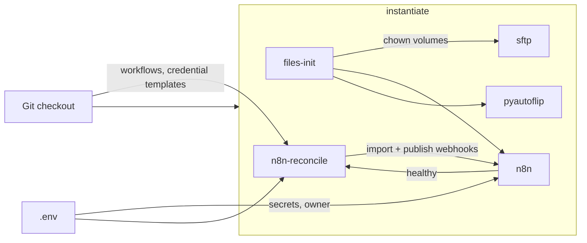
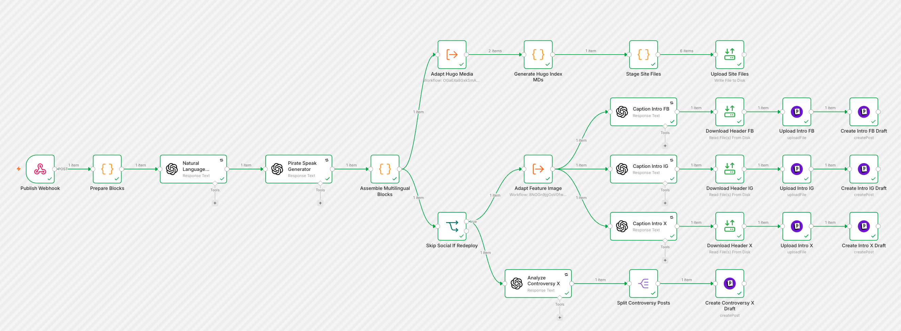
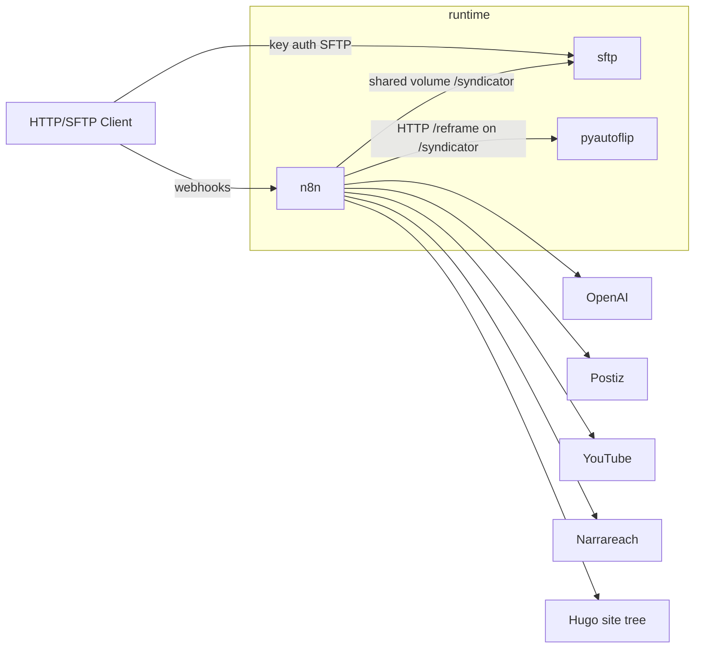

# Syndicator

Syndicator takes a blog post and:
1. Generate a static web site translated to EN, DE, ES, FR, IT, and Pirate Speak
2. Distribute the blog post to social media platforms Instagram, Facebook, YouTube, Twitter, Substack and Medium.

It uses AI extensively for various aspects like translation, post text generation, and media cropping.

## Context


<!--
ASCII context (kept for LLM / text-only readers):

                      syndicate
[HTTP/SFTP Client]───────( ○───────[Syndicator]───────( ○───────[Postiz]───────( ○───────[Social Media Platform]
                                        │
                                        ├──────( ○───────[OpenAI]
                                        │
                                        ├──────( ○───────[Hugo]
                                        │
                                        └──────( ○───────[Narrareach]───────( ○───────[Substack, Medium]
-->

Syndicator provides the `syndicate` interface specified in this document.

* Syndicator uses [Postiz](https://postiz.com/) to schedule social media posts.
* Syndicator uses [Narrareach](https://www.narrareach.com/) to schedule to Substack and Medium (title, subtitle, and body).
* Syndicator uses [OpenAI](https://openai.com/) for AI tasks.
* Syndicator uses [Hugo](https://gohugo.io/) to generate static blog post site.

## syndicate interface

Callers invoke syndicate by:

1. uploading medias to SFTP (port `2222`, key-only; authorize a public key in `sftp/keys/`)
2. POSTing JSON to the Blog Post Publish and Reel Publish webhook. 
3. The webhook responds with HTTP 2xx as soon as the request is accepted and continues asynchronously.

When Syndicator is done processing the webhook calls, callers can:
* Review posts in Postiz and Narrareach
* Fetch the static webpage from SFTP

### Media Upload

Before the webhooks are invoked the blog post medias have to be made available to Syndicator through SFTP in following form:

```text
<base>/<slug>/source/
├── header.<ext>          # featured image (required for publish)
├── photo.jpg             # body assets by basename
└── clip.mp4
```

| Path | Role |
|------|------|
|`<base>`|`syndicator`|
|`<slug>`|whatever you need to identify your blog post, for example `2026-06-03_Athen`|
| `<base>/<slug>/source/<filename>` | Original media uploaded by the caller |
| `<base>/<slug>/source/header.<ext>` | Featured/header image (basename convention) |

### Blog Post Publish

`POST` JSON to the configured publish webhook URL (path `/webhook/publish`). Any HTTP 2xx means accepted. Response body is ignored.

```json
{
  "slug": "2024-06-14_Renan",
  "meta": {
    "title": "Renan",
    "date": "2024-06-14",
    "language": "english",
    "lang_code": "en",
    "author": "Benno",
    "summary": "Short summary…",
    "position": "38.98000,1.430000"
  },
  "post_url": "https://example.org/posts/2024-06-14_renan/",
  "blocks": [
    {"kind": "text", "raw": "First paragraph…"},
    {"kind": "title", "raw": "### The Idea", "heading_level": 3},
    {
      "kind": "media",
      "media": {
        "kind": "image",
        "source_filename": "photo.jpg",
        "alt": "photo"
      }
    },
    {
      "kind": "youtube",
      "media": {"kind": "youtube", "youtube_id": "FAIZtHHsbSM"}
    },
    {
      "kind": "media",
      "media": {
        "kind": "video",
        "source_filename": "clip.mp4",
        "alt": "clip"
      }
    }
  ],
  "header_source": "header.jpg",
  "flags": {"redeploy": false}
}
```

| Field | Meaning |
|-------|---------|
| `slug` | Post id; must match the SFTP directory name under `<base>/` |
| `meta.*` | Title, date, language word + `lang_code`, author, summary, position |
| `post_url` | Canonical URL for the post (caller-computed) |
| `blocks[]` | Ordered content; kinds `title`, `text`, `youtube`, `media` |
| `blocks[].media.source_filename` | Basename present under `<base>/<slug>/source/` in SFTP |
| `header_source` | Basename of the header file under `<base>/<slug>/source/` (e.g. `header.jpg`) |
| `flags.redeploy` | `false` = full publish (site + social); `true` = site-only rebuild, no drafts |

Once Syndicator has finished processing Blog Post Publish the static Hugo post can be retrieved through SFTP at following location:

```text
<base>/hugo-site/
└── content/posts/<slug>/
    ├── index.<lang>.md
    ├── …
    └── <post media>
```

### Reel Publish

`POST` JSON to the configured reel webhook URL (path `/webhook/reel`). One call per local video. Any HTTP 2xx means accepted. Response body is ignored.

```json
{
  "slug": "2024-06-14_Renan",
  "post": {
    "title": "Renan",
    "url": "https://example.org/posts/2024-06-14_renan/",
    "summary": "Short summary…",
    "lang_code": "en"
  },
  "video": {
    "index": 1,
    "section_title": "The Player",
    "section_text": "Prose with a [VIDEO] marker at the clip…",
    "alt": "dingy.mp4"
  },
  "source": {"filename": "dingy.mp4"}
}
```

| Field | Meaning |
|-------|---------|
| `video.index` | 1-based index of this video in the post |
| `video.section_title` | Nearest section heading, if any |
| `video.section_text` | Caption context; conventionally includes a `[VIDEO]` marker |
| `source.filename` | Basename under `<base>/<slug>/source/` |

## Setup

```bash
scripts/init.sh
# Fill the values requested in .env, then:
docker compose up -d --build
bin/syndicator verify
```

`init.sh` creates `.env` and an encryption key. Compose builds and starts the stack. `verify` reconciles n8n credentials and workflows inside Compose, then checks n8n, webhook registration, pyautoflip, and SFTP. It is safe to run repeatedly; an unchanged reconcile is skipped.

`NARRAREACH_API_TOKEN` is optional. Leave it empty to instantiate Syndicator without Substack and Medium. When set, use an automation token from Narrareach settings (`articles:write`); Substack and Medium must already be connected in that Narrareach account. YouTube OAuth is only required when a post contains local video files (they are uploaded unlisted so Substack and Medium get embeds). Connect it once in the n8n UI (Google sign-in); it is not an env value. Without the Narrareach token, Blog Post Publish skips the Narrareach branch. Without YouTube OAuth, posts that have local videos skip that branch; posts without local videos still schedule to Substack and Medium.

Owner account is provisioned from env on n8n start (`N8N_INSTANCE_OWNER_*`). After n8n is healthy, the `n8n-reconcile` service logs in with `N8N_OWNER_EMAIL` / `N8N_OWNER_PASSWORD`, imports credentials and workflows from git, and publishes webhooks. UI login uses the same owner credentials.

Authorize callers by copying a `.pub` into `sftp/keys/` and recreating the SFTP service (`docker compose up -d --force-recreate sftp`). Host keys live in the `sftp_host_keys` volume (generated on first start). Connect on port `2222` as user `sftp`.

Published ports bind to loopback by default. Read the [operations runbook](docs/operations.md) before enabling LAN or internet access.

The `files-init` Compose service chowns the shared `n8n_files` and `sftp_data` volumes to uid/gid `1000` on each `up` so n8n, pyautoflip, and SFTP can write.

## Update workflows

`bin/syndicator export` exports sanitized workflows from n8n into `n8n/workflows/`.

## Updates and recovery

Instances are disposable. `.env`, SFTP host keys, and authorized client keys are identity; everything else can be rebuilt from git.

Pull a reviewed revision and run `docker compose up -d --build --pull always`, then `bin/syndicator verify`. If verify fails, bring the stack down, fix the checkout, and start again.

Disaster recovery is a new instance: reprovide `.env`, run `scripts/init.sh` and `docker compose up -d --build`, then `bin/syndicator verify`. Regenerate SFTP keys unless you kept them outside Syndicator. Callers may need to accept a new SSH host key and re-upload files.

## Architecture

The workflow engine, n8n, orchestrates all blog post processing via modular workflows. The most important non-functional requirements are repeatability, testability, automation, and maintainability. The initial custom pipeline became difficult to change, which motivated decomposing processing into visible workflow nodes.

Compose remains the application boundary because it isolates three different runtimes and provides the same topology on macOS and Linux. Instantiate with Compose; `bin/syndicator` covers verify, export, and logs. The rationale and rejected alternatives are recorded in [ADR 0001](docs/adr/0001-deployment-model.md); disposable instances are [ADR 0002](docs/adr/0002-disposable-instances.md).
 
## Software Design

Software design is split into **instantiation** (how an instance is built and started) and **runtime structure** (what runs once the stack is up).

### Instantiation

To start an instance you need this repository and a filled-in `.env`. `docker compose up --build` builds the images and starts sftp, n8n, and pyautoflip. n8n comes up with an owner account from `.env`, but not yet with Syndicator's workflows. `n8n-reconcile` then logs into that n8n, creates credentials from `.env`, imports the workflow JSON from git, and publishes the webhooks. After that the instance matches this checkout.



| Component | Role |
|-----------|------|
| Git checkout | Blueprint: Compose file, Dockerfiles, workflow JSON, credential templates, SFTP startup hook, authorized `.pub` keys |
| `.env` | Instance identity: encryption key, owner login, API keys, bind addresses. Created from `.env.example` by `scripts/init.sh` |
| `files-init` | One-shot: chowns shared `n8n_files` and `sftp_data` to uid/gid `1000` so n8n, pyautoflip, and SFTP can write |
| `sftp` | Starts with `sftp/setup.sh`: durable host keys in `sftp_host_keys`, client keys from `sftp/keys/` |
| `n8n` | Custom image (`ffmpeg`, community nodes). On start, hashes `N8N_OWNER_PASSWORD` and provisions the owner from env. SQLite lives in `n8n_data` |
| `pyautoflip` | Custom image; shares `sftp_data` at `/syndicator` with n8n |
| `n8n-reconcile` | Compose profile `reconcile`, not a long-running service. Logs in as owner, renders credential templates from `.env`, imports workflows from git, publishes webhooks |

`bin/syndicator verify` is the operator gate after `docker compose up`: it waits for n8n, runs reconcile, then checks health, webhook registration, pyautoflip, and SFTP. Export and logs are the other CLI commands; they are not part of instantiate.

Git remains source of truth for workflows. n8n's volume is disposable; a new instance re-imports from git. See [ADR 0001](docs/adr/0001-deployment-model.md) and [ADR 0002](docs/adr/0002-disposable-instances.md).

### Runtime structure



Once instantiated, three services collaborate: callers reach **sftp** (files) and **n8n** (webhooks); n8n reads and writes the shared SFTP volume, **pyautoflip**, and external APIs.



| Service | Role |
|---------|------|
| `sftp` | Key-only SFTP on port `2222`; chroot home with `/syndicator/…`; host keys in `sftp_host_keys` |
| `n8n` | Workflow engine; SQLite in `n8n_data`; shares `n8n_files` → `/files` with pyautoflip and `sftp_data` → `/syndicator` |
| `pyautoflip` | Reel reframing sidecar (`HTTP /reframe` on `/syndicator`) |

| Workflow | Role |
|----------|------|
| Blog Post Publish | Webhook `/webhook/publish` → Hugo adapt + social feature adapt + Narrareach (Substack, Medium) |
| Reel Publish | Webhook `/webhook/reel` → adapt → caption → Postiz |

For brevity, subworkflows invoked by these workflows are not listed here.

