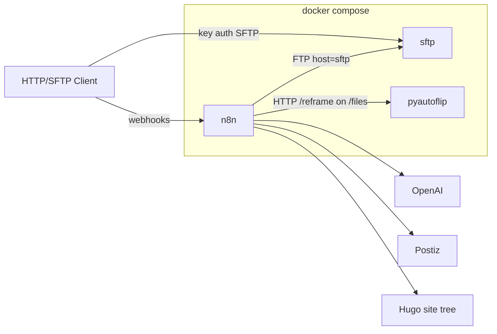

# Syndicator

Syndicator can take a blog post and:
1. Generate a static web site translated to languages EN, FR, ES, SP, IT, and Pirate Speak
2. Distribute the blog post and its content to social media platforms Instagram, Facebook, Youtube, and X.

It uses AI extensively for various aspects like translation, post text generation, and media cropping.

## Architecture

```
                      syndicate
[HTTP/SFTP Client]───────( ○───────[Syndicator]───────( ○───────[Postiz]───────( ○───────[Social Media Platform]
                                        │
                                        ├──────( ○───────[OpenAI]
                                        │
                                        └──────( ○───────[Hugo]
```

Syndicator provides the `syndicate` interface specified in this document.

* Syndicator uses [Postiz](https://postiz.com/) to schedule social media posts.
* Syndicator uses [OpenAI](https://openai.com/) for KI tasks.
* Syndicator uses [Hugo](https://gohugo.io/) to generate static blog post site.

## syndicate interface

Callers invoke syndicate by:

1. uploading medias to SFTP
2. POSTing JSON to the Blog Post Publish and Reel Publish webhook. 
3. The webhook responds with HTTP 2xx as soon as the request is accepted and continues asynchronously.

When Syndicator is done processing the webhook calls, callers can:
* Review post drafts in Postiz
* Fetch the static webpage from SFTP

### Media Upload

Before the webhooks are invoked the blog post medias have to be made available to Syndicator through SFTP in following form:

```text
<base>/<slug>/source/
├── header.<ext>          # featured image (required for publish)
├── photo.jpg             # body assets by basename
└── clip.mp4
```

| Path | Role |
|------|------|
|`<base>`|`syndicator`|
|`<slug>`|whatever you need to identify your blog post, for example `2026-06-03_Athen`|
| `<base>/<slug>/source/<filename>` | Original media uploaded by the caller |
| `<base>/<slug>/source/header.<ext>` | Featured/header image (basename convention) |

### Blog Post Publish

`POST` JSON to the configured publish webhook URL (path `/webhook/publish`). Any HTTP 2xx means accepted. Response body is ignored.

```json
{
  "slug": "2024-06-14_Renan",
  "meta": {
    "title": "Renan",
    "date": "2024-06-14",
    "language": "english",
    "lang_code": "en",
    "author": "Benno",
    "summary": "Short summary…",
    "position": "38.98000,1.430000"
  },
  "post_url": "https://example.org/posts/2024-06-14_renan/",
  "blocks": [
    {"kind": "text", "raw": "First paragraph…"},
    {"kind": "title", "raw": "### The Idea", "heading_level": 3},
    {
      "kind": "media",
      "media": {
        "kind": "image",
        "source_filename": "photo.jpg",
        "alt": "photo"
      }
    },
    {
      "kind": "youtube",
      "media": {"kind": "youtube", "youtube_id": "FAIZtHHsbSM"}
    },
    {
      "kind": "media",
      "media": {
        "kind": "video",
        "source_filename": "clip.mp4",
        "alt": "clip"
      }
    }
  ],
  "header_source": "header.jpg",
  "flags": {"redeploy": false}
}
```

| Field | Meaning |
|-------|---------|
| `slug` | Post id; must match the SFTP directory name under `<base>/` |
| `meta.*` | Title, date, language word + `lang_code`, author, summary, position |
| `post_url` | Canonical URL for the post (caller-computed) |
| `blocks[]` | Ordered content; kinds `title`, `text`, `youtube`, `media` |
| `blocks[].media.source_filename` | Basename present under `<base>/<slug>/source/` in SFTP |
| `header_source` | Basename of the header file under `<base>/<slug>/source/` (e.g. `header.jpg`) |
| `flags.redeploy` | `false` = full publish (site + social drafts); `true` = site-only rebuild, no drafts |

Once Syndicator has finished processing Blog Post Publish the static Hugo post can be retrieved through SFTP at following location:

```text
<base>/hugo-site/
└── content/posts/<slug>/
    ├── index.<lang>.md
    ├── …
    └── <post media>
```

### Reel Publish

`POST` JSON to the configured reel webhook URL (path `/webhook/reel`). One call per local video. Any HTTP 2xx means accepted. Response body is ignored.

```json
{
  "slug": "2024-06-14_Renan",
  "post": {
    "title": "Renan",
    "url": "https://example.org/posts/2024-06-14_renan/",
    "summary": "Short summary…",
    "lang_code": "en"
  },
  "video": {
    "index": 1,
    "section_title": "The Player",
    "section_text": "Prose with a [VIDEO] marker at the clip…",
    "alt": "dingy.mp4"
  },
  "source": {"filename": "dingy.mp4"}
}
```

| Field | Meaning |
|-------|---------|
| `video.index` | 1-based index of this video in the post |
| `video.section_title` | Nearest section heading, if any |
| `video.section_text` | Caption context; conventionally includes a `[VIDEO]` marker |
| `source.filename` | Basename under `<base>/<slug>/source/` |

## Setup

```bash
cp .env.example .env        
docker compose up -d --build
```
* Go to http://<host>:5678 and create your owner account.
* Go to settings > n8n API and create an API Key
* Store the key in .env N8N_API_KEY
* Create public/private key and put the **private** key at `secrets/sftp_n8n_ed25519` and the **public** key in `sftp/keys/`
* Set all other secrets in .env (OpenAI, Postiz, SFTP)

```bash
./scripts/bootstrap-n8n.sh
```

Docker named volumes are often created as root. After first `compose up` (or a volume recreate), fix ownership so the compose users can write:

```bash
# SFTP user is uid 1001 / gid 100
docker run --rm -v syndicator_sftp_data:/data alpine sh -c 'chown -R 1001:100 /data && chmod 755 /data'
# n8n + pyautoflip share /files as uid 1000
docker run --rm -v syndicator_n8n_files:/data alpine sh -c 'chown -R 1000:1000 /data && chmod 775 /data'
```

## Update Worfklows

`./scripts/export-workflows.sh` exports all workflows from n8n into workflows/ folder in this repo

## Automatic updates

`scripts/update.sh` rebuilds with `--pull`, recreates containers, prunes old images, leaves volumes alone. Covers **n8n and pyautoflip**.

Logs default to `update.log` (`UPDATE_LOG` to override).

## Software Design



| Service | Role |
|---------|------|
| `sftp` | Key-only SFTP; chroot home with `/syndicator/…` |
| `n8n` | Custom image (`ffmpeg` + Postiz + FFmpeg Studio community nodes); SQLite in `n8n_data` |
| `pyautoflip` | Reel reframing sidecar; shares `n8n_files` → `/files` with n8n |

| Piece | Role |
|-------|------|
| `docker-compose.yml` | Compose stack: SFTP + n8n + pyautoflip |
| `scripts/` | bootstrap / export / update |
| `n8n/workflows/` | Importable workflow exports (source of truth) |
| `n8n/credentials/` | Credential templates (stable IDs; secrets from `.env`) |
| `pyautoflip/` | Saliency reframe HTTP sidecar for Adapt Reel Media |

| Workflow | Role |
|----------|------|
| Blog Post Publish | Webhook `/publish` → Hugo adapt + social feature adapt |
| Reel Publish | Webhook `/reel` → adapt → caption → Postiz |
| Adapt Hugo Media | Sub-workflow: Hugo media from blocks |
| Adapt Feature Image | Sub-workflow: social header crops |
| Adapt Reel Media | Sub-workflow: reel reframe via pyautoflip |
| Syndicator Error | Shared `errorWorkflow` |

```
docker-compose.yml
.env.example
n8n/Dockerfile          # ffmpeg + community node seed
n8n/workflows/          # importable exports (source of truth)
n8n/credentials/*.template.json
pyautoflip/             # Adapt Reel Media sidecar
sftp/keys/              # authorized public keys (gitignored contents)
scripts/{bootstrap,export,update}.sh
systemd/*               # optional timer
```

Staging is not garbage-collected automatically; purge `/syndicator/` periodically. Align Hugo output with `<base>/hugo-site/` (not a site-specific name).


