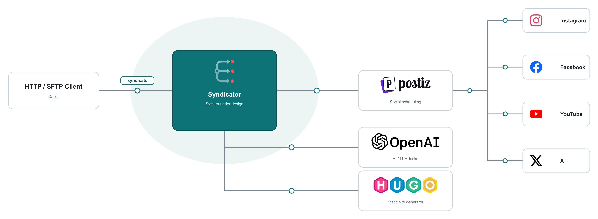
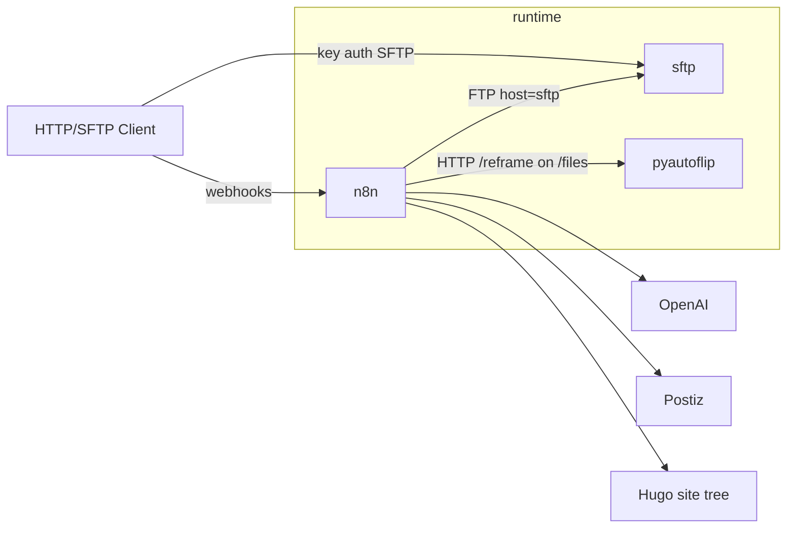

# Syndicator

Syndicator takes a blog post and:
1. Generate a static web site translated to EN, DE, ES, FR, IT, and Pirate Speak
2. Distribute the blog post to social media platforms Instagram, Facebook, YouTube, and X.

It uses AI extensively for various aspects like translation, post text generation, and media cropping.

## Context



<!--
ASCII context (kept for LLM / text-only readers):

                      syndicate
[HTTP/SFTP Client]───────( ○───────[Syndicator]───────( ○───────[Postiz]───────( ○───────[Social Media Platform]
                                        │
                                        ├──────( ○───────[OpenAI]
                                        │
                                        └──────( ○───────[Hugo]
-->

Syndicator provides the `syndicate` interface specified in this document.

* Syndicator uses [Postiz](https://postiz.com/) to schedule social media posts.
* Syndicator uses [OpenAI](https://openai.com/) for AI tasks.
* Syndicator uses [Hugo](https://gohugo.io/) to generate static blog post site.

## syndicate interface

Callers invoke syndicate by:

1. uploading medias to SFTP (port `2222`, key-only; authorize a public key in `sftp/keys/`, or reuse `secrets/sftp_n8n_ed25519` from `./scripts/ensure-sftp-keys.sh`)
2. POSTing JSON to the Blog Post Publish and Reel Publish webhook. 
3. The webhook responds with HTTP 2xx as soon as the request is accepted and continues asynchronously.

When Syndicator is done processing the webhook calls, callers can:
* Review post drafts in Postiz
* Fetch the static webpage from SFTP

### Media Upload

Before the webhooks are invoked the blog post medias have to be made available to Syndicator through SFTP in following form:

```text
<base>/<slug>/source/
├── header.<ext>          # featured image (required for publish)
├── photo.jpg             # body assets by basename
└── clip.mp4
```

| Path | Role |
|------|------|
|`<base>`|`syndicator`|
|`<slug>`|whatever you need to identify your blog post, for example `2026-06-03_Athen`|
| `<base>/<slug>/source/<filename>` | Original media uploaded by the caller |
| `<base>/<slug>/source/header.<ext>` | Featured/header image (basename convention) |

### Blog Post Publish

`POST` JSON to the configured publish webhook URL (path `/webhook/publish`). Any HTTP 2xx means accepted. Response body is ignored.

```json
{
  "slug": "2024-06-14_Renan",
  "meta": {
    "title": "Renan",
    "date": "2024-06-14",
    "language": "english",
    "lang_code": "en",
    "author": "Benno",
    "summary": "Short summary…",
    "position": "38.98000,1.430000"
  },
  "post_url": "https://example.org/posts/2024-06-14_renan/",
  "blocks": [
    {"kind": "text", "raw": "First paragraph…"},
    {"kind": "title", "raw": "### The Idea", "heading_level": 3},
    {
      "kind": "media",
      "media": {
        "kind": "image",
        "source_filename": "photo.jpg",
        "alt": "photo"
      }
    },
    {
      "kind": "youtube",
      "media": {"kind": "youtube", "youtube_id": "FAIZtHHsbSM"}
    },
    {
      "kind": "media",
      "media": {
        "kind": "video",
        "source_filename": "clip.mp4",
        "alt": "clip"
      }
    }
  ],
  "header_source": "header.jpg",
  "flags": {"redeploy": false}
}
```

| Field | Meaning |
|-------|---------|
| `slug` | Post id; must match the SFTP directory name under `<base>/` |
| `meta.*` | Title, date, language word + `lang_code`, author, summary, position |
| `post_url` | Canonical URL for the post (caller-computed) |
| `blocks[]` | Ordered content; kinds `title`, `text`, `youtube`, `media` |
| `blocks[].media.source_filename` | Basename present under `<base>/<slug>/source/` in SFTP |
| `header_source` | Basename of the header file under `<base>/<slug>/source/` (e.g. `header.jpg`) |
| `flags.redeploy` | `false` = full publish (site + social drafts); `true` = site-only rebuild, no drafts |

Once Syndicator has finished processing Blog Post Publish the static Hugo post can be retrieved through SFTP at following location:

```text
<base>/hugo-site/
└── content/posts/<slug>/
    ├── index.<lang>.md
    ├── …
    └── <post media>
```

### Reel Publish

`POST` JSON to the configured reel webhook URL (path `/webhook/reel`). One call per local video. Any HTTP 2xx means accepted. Response body is ignored.

```json
{
  "slug": "2024-06-14_Renan",
  "post": {
    "title": "Renan",
    "url": "https://example.org/posts/2024-06-14_renan/",
    "summary": "Short summary…",
    "lang_code": "en"
  },
  "video": {
    "index": 1,
    "section_title": "The Player",
    "section_text": "Prose with a [VIDEO] marker at the clip…",
    "alt": "dingy.mp4"
  },
  "source": {"filename": "dingy.mp4"}
}
```

| Field | Meaning |
|-------|---------|
| `video.index` | 1-based index of this video in the post |
| `video.section_title` | Nearest section heading, if any |
| `video.section_text` | Caption context; conventionally includes a `[VIDEO]` marker |
| `source.filename` | Basename under `<base>/<slug>/source/` |

## Setup

```bash
bin/syndicator init
# Fill the values requested in .env, then:
bin/syndicator deploy
```

`deploy` checks prerequisites, generates local-only keys, builds and starts the stack, reconciles n8n credentials/workflows, and verifies n8n, pyautoflip, and SFTP. It is safe to run repeatedly; an unchanged bootstrap is skipped.

Owner account is provisioned from env on n8n start (`N8N_INSTANCE_OWNER_*`). Bootstrap logs in with `N8N_OWNER_EMAIL` / `N8N_OWNER_PASSWORD` to create or reuse an API key at `secrets/n8n_api_key` (or uses `N8N_API_KEY` if set), then imports credentials/workflows and publishes webhooks. UI login uses the same owner credentials.

`init` writes `secrets/sftp_n8n_ed25519` (private), `sftp/keys/n8n.pub` (public), and `secrets/n8n_owner.env` (bcrypt hash for Compose). Extra client keys: copy any `.pub` into `sftp/keys/` and run `bin/syndicator restart sftp`. Host keys live in the `sftp_host_keys` volume (generated on first start). Connect on port `2222` as user `sftp`.

Published ports bind to loopback by default. Read the [operations runbook](docs/operations.md) before enabling LAN or internet access.

The `files-init` Compose service chowns the shared `n8n_files` volume to uid/gid `1000` on each `up` so n8n and pyautoflip can write under `/files`.

## Update workflows

`bin/syndicator export` exports sanitized workflows from n8n into `n8n/workflows/`.

## Updates and recovery

Instances are disposable. `.env`, SFTP host keys, and authorized client keys are identity; everything else can be rebuilt from git.

Pull a reviewed revision and run `bin/syndicator deploy` (add `--pull` to refresh base images). A failed deploy stops the unverified services; fix the checkout and deploy again.

Disaster recovery is a new instance: reprovide `.env`, run `init` and `deploy`, and regenerate SFTP keys unless you kept them outside Syndicator. Callers may need to accept a new SSH host key and re-upload files.

## Architecture

The workflow engine, n8n, orchestrates all blog post processing via modular workflows. The most important non-functional requirements are repeatability, testability, automation, and maintainability. The initial custom pipeline became difficult to change, which motivated decomposing processing into visible workflow nodes.

Compose remains the application boundary because it isolates three different runtimes and provides the same topology on macOS and Linux. The operator lifecycle is intentionally separate and tested through `bin/syndicator`. The rationale and rejected alternatives are recorded in [ADR 0001](docs/adr/0001-deployment-model.md); disposable instances are [ADR 0002](docs/adr/0002-disposable-instances.md).
 
## Software Design

Software design is split into **instantiation** (how an instance is built and started) and **runtime structure** (what runs once the stack is up).

### Instantiation

The repo is the blueprint for a containerized instance: Compose defines the stack, scripts bootstrap credentials and import workflows, and the rest is source material those steps consume.

| Piece | Role |
|-------|------|
| `docker-compose.yml` | Compose stack: files-init + SFTP + n8n + pyautoflip |
| `.env.example` | Env template for secrets and host paths |
| `n8n/Dockerfile` | Custom n8n image (`ffmpeg` + community node seed) |
| `sftp/setup.sh` | Supported atmoz startup hook for durable host keys, key sync, and ownership |
| `scripts/` | Focused lifecycle implementations behind `bin/syndicator` |
| `n8n/workflows/` | Importable workflow exports (source of truth) |
| `n8n/credentials/` | Credential templates (stable IDs; secrets from `.env`) |
| `pyautoflip/` | Image/build context for the reframe sidecar |
| `sftp/keys/` | Authorized client public keys (refreshed into `authorized_keys` on each sftp start) |
| `bin/syndicator` | Checked lifecycle: init, deploy, bootstrap, verify, export |

```
docker-compose.yml
.env.example
n8n/Dockerfile
n8n/workflows/
n8n/credentials/*.template.json
pyautoflip/
sftp/
scripts/{init,deploy,bootstrap,verify,export}.sh
docs/{operations.md,adr/}
bin/syndicator
```

### Runtime structure

Once instantiated, three services collaborate: callers reach **sftp** (files) and **n8n** (webhooks); n8n drives SFTP, **pyautoflip**, and external APIs.



| Service | Role |
|---------|------|
| `sftp` | Key-only SFTP on port `2222`; chroot home with `/syndicator/…`; host keys in `sftp_host_keys` |
| `n8n` | Workflow engine; SQLite in `n8n_data`; shares `n8n_files` → `/files` with pyautoflip |
| `pyautoflip` | Reel reframing sidecar (`HTTP /reframe` on `/files`) |

| Workflow | Role |
|----------|------|
| Blog Post Publish | Webhook `/webhook/publish` → Hugo adapt + social feature adapt |
| Reel Publish | Webhook `/webhook/reel` → adapt → caption → Postiz |

For brevity, subworkflows invoked by these workflows are not listed here.

