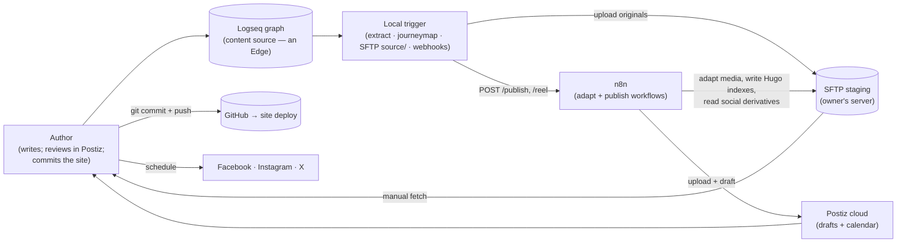
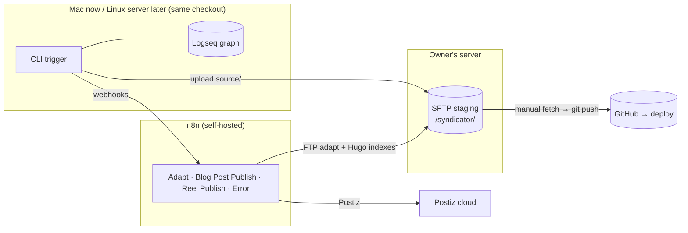

# Syndicator — Architecture (arc42)

This document describes the architecture of **Syndicator**, the publish
pipeline behind [sailingnomads.ch](https://www.sailingnomads.ch), following the
[arc42](https://arc42.org) template.

**v2 (n8n migration).** Syndicator was a ~3,800-line, two-machine Python
pipeline that did everything locally (translate, render, commit, plan and
export social posts) with state kept inside the Logseq graph. It is now a
**thin local trigger** plus **three stateless n8n workflows**; the design
record and every decision (including rejected alternatives) live in
[n8n-migration.md](n8n-migration.md). This document describes the resulting
system.

It stays on the **meta level**: the concepts and the boundaries between them.
Concrete file formats, function signatures and per-module behavior are
documented in the code, not here. Keep this document in sync when you change
the architecture — not when you add another instance of an existing concept.

---

## 1. Introduction and Goals

### 1.1 What the system does

The authors keep a diary in Logseq; some diary branches are blog posts.
Syndicator picks these up and produces everything "publishing" means for this
blog:

- a **multilingual Hugo site** (`en`/`de`/`es`/`fr`/`it` + pirate), rendered
  and translated **in n8n**, staged back to the SFTP area, and committed to
  GitHub `main` **by hand** from the owner's site checkout (the push triggers
  the existing deploy);
- an animated **journey map** (generated **locally** by Go tools, shipped as
  `journey-map.mp4`);
- **social drafts** — one intro post per blog post and one reel per video, per
  platform (Facebook, Instagram, X) — created **in n8n** as **Postiz drafts**.

A human reviews and schedules the drafts in the **Postiz calendar**; nothing
reaches a platform until scheduled there. There is no Logseq review page, no
content hashing, no scheduled-slot automation.

The system is operated through **one driver**: a CLI with two commands,
`syndicate` and `redeploy` — plus one deliberate manual step: fetching the
staged site output from SFTP and committing it to the site repo. The daemon
and all review/state commands were removed.

### 1.2 Quality Goals

| # | Goal | Meaning |
|---|---|---|
| 1 | **Thin, private local edge** | Only the local trigger reads the diary. The privacy boundary is enforced there: only `type:: blog` + `status:: online` branches ever leave the machine. |
| 2 | **Stateless cloud** | Every n8n execution starts, runs minutes, ends. No Wait nodes, no queues, no static data — heavy lifting without operational state. |
| 3 | **Idempotent hand-off** | Uploads overwrite in place; the site commit is content-addressed. Re-running is safe; the marker records hand-off, not completion. |
| 4 | **Reviewability** | Everything social lands as an editable Postiz draft; the calendar is the human gate and the schedule queue. |

### 1.3 Stakeholders

| Role | Expectation |
|---|---|
| Owner / author / operator (Benno) | Writes in Logseq, runs `syndicate`, reviews/schedules in Postiz; near-zero operational effort. |
| LLM coding agents & future contributors | Extend the system without breaking its boundaries; this document is the stable frame of reference. |

---

## 2. Architecture Constraints

| Constraint | Consequence |
|---|---|
| Self-hosted n8n (same machine as SFTP) | Media adapt runs in n8n (Edit Image + `n8n-nodes-ffmpeg-studio` + OpenAI focus). Large binaries may load into workflow RAM; prefer path-based FFmpeg where possible. |
| Media transport via SFTP staging | Client writes immutable originals under `/syndicator/<slug>/source/`; n8n builds `/syndicator/sailingnomads/` and social derivatives. Nobody deletes automatically. |
| Media adaptation in n8n | Crop/resize/reencode and crop-focus live in Adapt Hugo / Adapt Feature / Adapt Reel sub-workflows; local trigger does not run ffmpeg/Pillow. |
| One commit per publish | The owner fetches the staged post from SFTP into the site checkout and commits/pushes by hand, so a publish is a single deploy. n8n has no GitHub access and never touches a site binary. |
| URL-as-secret webhooks | The two webhook URLs are the only auth; keep them out of the public. |
| Runs from a checkout | Local prompts, shared config and tool binaries are resolved relative to the repo; run via `uv run syndicator …`. Mac-first, Linux-compatible. |

---

## 3. Context and Scope

Syndicator sits between a **content source** (the Logseq graph) and several
**publishing targets**, but the local core now talks to only two edges
directly: the diary (read) and the SFTP staging area + webhooks (write). n8n
owns the remaining edges.

**The Logseq graph is at the very edge and is now read-only to the system** —
it is no longer a state store or a review UI. State moved out: hand-off is
recorded as a single `syndicated-at::` property on the blog post; review and
scheduling state live in Postiz; site history lives in git. Swapping the diary
edge means changing only the local `extract` boundary.

---

## 4. Solution Strategy

Two cooperating layers with a small, explicit contract between them.

**Local trigger (Python).** A small set of modules, each *inputs → outputs*,
all deterministic:

- `extract` — Logseq graph → `BlogPost` (domain model + privacy boundary).
- `journeymap` — Go tools → the global `journey-map.mp4` (deterministic, so
  git content-addressing dedupes it).
- `trigger` — stage originals into `<slug>/source/`, build `/publish` and
  `/reel` payloads, orchestrate `syndicate` / `redeploy`.
- `sftp` — resumable, idempotent uploads of originals under ``source/``.
- `webhook` — POSTs with retries; expects `{"status":"accepted"}`.
- `marker` — writes `syndicated-at::` after all webhooks were accepted.

The last leg — SFTP staging → site repo — is a **manual step by design**: the
owner recursively fetches `/syndicator/sailingnomads/` into the existing site
checkout, reviews the diff, commits and pushes. The SFTP subtree already has
the exact Hugo layout, so no manifest or file rearranging is needed.

**n8n (stateless workflows).** See [n8n-media-adapt-notes.md](n8n-media-adapt-notes.md).

- **Adapt Hugo Media**: Hugo images are copied; Hugo videos are FFmpeg-resized
  only (no crop). **Adapt Feature Image**: crop-focus the feature image into
  social headers. **Adapt Reel Media**: FFmpeg 4:5 crop. None modify `source/`.
- **Blog Post Publish** (`/publish`): respond early → translate/assemble →
  Adapt Hugo Media → Generate Hugo indexes → upload; unless `flags.redeploy`,
  Adapt Feature Image then Postiz intro drafts from header crops.
- **Reel Publish** (`/reel`): respond early → adapt → vision captions → Postiz
  reel drafts.
- **Syndicator Error**: Error Trigger → Mailgun; shared `settings.errorWorkflow`.

The contract is intentionally narrow: **slug + basenames** in the webhook
bodies; n8n derives chroot-absolute SFTP paths from fixed layout conventions.

---

## 5. Building Block View

### 5.1 Concept → code map

| Concept | Realized in |
|---|---|
| Driver (CLI) | `cli.py` — argparse: `syndicate`, `redeploy`, `version` |
| Orchestrator + contracts | `trigger.py` — staging, payload builders, `syndicate` / `redeploy` |
| Domain model + extract | `extract.py` — `BlogPost`, `Section`, `MediaRef`, `Block`, `Meta` |
| Journey map | `journeymap.py` — Go tool wrappers |
| Transport | `sftp.py`, `webhook.py` |
| Site commit | manual: recursively fetch `/syndicator/sailingnomads/` into the site checkout, then git commit/push |
| Hand-off state | `marker.py` — the `syndicated-at::` property |
| Configuration | `config.py`: `syndicator.yaml` (shared) + `config.local.yaml` (machine paths, `sftp_key`) |
| Cloud "nodes" | Adapt Hugo Media / Adapt Feature Image / Adapt Reel Media + Blog Post Publish / Reel Publish / Syndicator Error |

### 5.2 What moved to n8n

Translation, captioning, **media adaptation** (headers, site videos, reels,
covers, crop-focus) and the Hugo front-matter/render live in n8n; the site
commit is manual. Media-rewriting helpers for the structured blocks payload
live in `trigger.py`. Crop geometry for Adapt workflows is inlined in the
n8n Code nodes (see `docs/*.json`).

### 5.3 Prompts & models

Prompts for translate/captions/crop-focus were ported into n8n OpenAI nodes;
the **n8n copies are authoritative**. `prompts/crop_focus.md` remains the
reference text for the focus prompt. Media geometry (Hugo resize, social
headers, reel 4:5) is hardcoded in the n8n Adapt workflows.

---

## 6. Runtime View

### 6.1 Publish (`syndicate`)

1. The author sets `status:: online` (with a `header::` image) and runs
   `syndicate`.
2. The trigger generates + uploads the global journey map once, then per post:
   upload `source/` originals → one `/reel` per video → `/publish`.
3. Each workflow responds `{"status":"accepted"}` immediately and continues
   async (adapt media, then translate/drafts). Once every webhook for a post
   was accepted, the trigger writes `syndicated-at::`.
4. n8n adapts media into the mirrored Hugo tree and social paths, renders +
   translates indexes, and creates the Postiz drafts. The author reviews and
   schedules drafts in the Postiz calendar.
5. The author recursively fetches `/syndicator/sailingnomads/` into the site
   checkout, reviews the diff, commits and pushes — the push triggers the
   deploy.

### 6.2 Redeploy (`redeploy --post`)

Site only: upload `source/` + journey map → `/publish` with
`flags.redeploy: true`. n8n re-adapts site media, re-renders and re-translates
into the mirrored Hugo tree; no drafts, no marker change. The manual fetch +
commit ships it.

### 6.3 Failure & recovery

Because the workflows respond early and there are no completion callbacks, the
marker means **handed off**, not **published**. Recovery is out-of-band by
failure class:

- **Handoff failure** — webhook never accepted after 3 retries: no marker, the
  next `syndicate` re-runs the whole post (duplicates are harmless).
- **Site async failure** — render/translate failed in n8n:
  `redeploy --post` re-runs and overwrites that post's staged Hugo files.
- **Social async failure** — re-run the failed n8n execution (URL in the error
  mail) or fix the draft in Postiz; `syndicate` skips the marked post.

---

## 7. Deployment View

- The local trigger runs on the Mac today; Go/SFTP stay Linux-compatible so
  the server can run it later. FFmpeg for adapt runs on the n8n host.
- n8n workflows are authored and updated through the **n8n MCP server**;
  MCP-created workflows are MCP-enabled automatically.
- No locking, no cross-machine state file: worst case is duplicate drafts,
  deleted by hand.

---

## 8. Cross-cutting Concepts

**Privacy boundary.** Only `type:: blog` + `status:: online` branches leave the
machine; the local `extract` node is the single enforcement point.

**Idempotency.** SFTP uploads and n8n index writes overwrite the mirrored Hugo
paths in place, so re-running a publish converges. The journey map render is
deterministic, so re-committing it every publish causes no repo bloat. Since
the site commit is a normal git commit in the local checkout, renames and
deletions are handled like any other site change.

**No change detection.** There is deliberately no hashing. `redeploy` re-runs
the whole site build (re-translates) by design; the only state is the new-post
marker plus Postiz and git history.

**Reel variants.** Adapt Reel Media hardcodes a single 4:5 encode under
`reels/4x5/`. Reel Publish posts that same file to FB/IG/X. A future 9:16
Shorts variant would be another hardcoded encode in Adapt, wired only to the
YouTube target in Reel Publish — not driven by `syndicator.yaml`.

**Cloud statelessness.** Workflows hold no state between executions; failure
handling is the error mail + manual recovery, never a state coupling back to
local.

---

## 9. Architecture Decisions

| # | Decision | Rationale |
|---|---|---|
| 1 | Thin local trigger + n8n workflows | Move heavy lifting (including media adapt) off the Python core; keep only the private diary edge and journey map local. |
| 2 | Postiz cloud for social | Drafts + calendar UI as the human review/schedule surface; open-source exit hatch; no own Meta/X developer apps. |
| 3 | SFTP staging as media transport | Resumable, no Cloud upload-size cap; n8n downloads, never deletes. |
| 4 | Site commit is a manual local step (supersedes: Git Data API commit in n8n) | The SFTP subtree mirrors the Hugo repo: local media uploads and n8n index writes meet under `/syndicator/sailingnomads/`, which can be fetched into the checkout in one operation. Removes the base64-in-RAM blob round-trip and GitHub credential in n8n, and adds a pre-deploy `git diff` gate — at the cost of one manual step. |
| 5 | Marker = hand-off, not completion | Workflows respond early; out-of-band recovery beats brittle completion callbacks. |
| 6 | n8n copies of prompts/models are authoritative | No include mechanism in n8n; avoid constant drift with `prompts/`. |

Superseded v1 decisions (plain-code pipeline, state in the Logseq graph,
in-Logseq review, hugo-hash change detection, the daemon) are retired; see
[n8n-migration.md §2](n8n-migration.md) for the full list and rejected
alternatives.

---

## 10. Risks and Accepted Trade-offs

- **Async failures after acceptance** leave a post marked; mitigated by the
  error mail + `redeploy` / n8n re-run paths (§6.3).
- **Postiz create budget:** a post costs `3 × (V+1)` `createPost` calls; a
  large first batch can exceed 30/h. The 429 surfaces via the error mail; the
  owner re-runs. Raising limits / node-level backoff is a later step.
- **Publish needs a manual step:** the site is live only after the owner
  fetches the staged output and pushes. Accepted deliberately — it doubles as
  the review gate.
- **Large media in n8n:** adapt may load binaries into workflow memory; accepted
  with self-hosted RAM headroom and path-based FFmpeg where available.
- **Staging area growth:** nobody deletes automatically; periodic manual
  purge.

---

## 11. Glossary

| Term | Definition |
|---|---|
| **Local trigger** | The Python CLI that reads the diary, adapts media, uploads over SFTP and fires the webhooks. The only diary reader. |
| **Workflow** | One stateless n8n execution graph (Blog Post Publish, Reel Publish, Syndicator Error). |
| **Staging area** | The chrooted `/syndicator/` SFTP tree. `/syndicator/<slug>/source/` holds immutable originals; `/syndicator/sailingnomads/` is the Hugo mirror built by n8n; `/syndicator/<slug>/header|reels|covers/` are social derivatives. |
| **`sftp_path`** | A chroot-absolute path used by SFTP upload/download nodes. Derived in n8n from slug + basename; the local uploader still builds absolute remotes when copying originals. |
| **Marker** | The `syndicated-at::` property; records hand-off (all webhooks accepted), not completion. |
| **Intro post** | One per blog post per platform: header crop + English summary caption. |
| **Reel** | One per video per platform: adapted vertical clip + English vision caption. |
| **Slug** | Stable post identifier (`<date>_<title>`); names the staging dir, bundle and drafts. |
