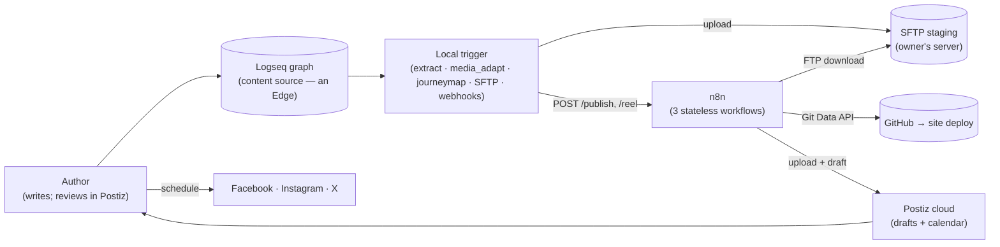
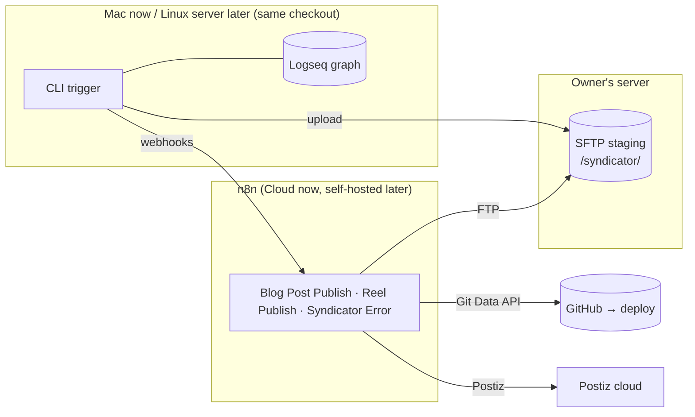

# Syndicator — Architecture (arc42)

This document describes the architecture of **Syndicator**, the publish
pipeline behind [sailingnomads.ch](https://www.sailingnomads.ch), following the
[arc42](https://arc42.org) template.

**v2 (n8n migration).** Syndicator was a ~3,800-line, two-machine Python
pipeline that did everything locally (translate, render, commit, plan and
export social posts) with state kept inside the Logseq graph. It is now a
**thin local trigger** plus **three stateless n8n workflows**; the design
record and every decision (including rejected alternatives) live in
[n8n-migration.md](n8n-migration.md). This document describes the resulting
system.

It stays on the **meta level**: the concepts and the boundaries between them.
Concrete file formats, function signatures and per-module behavior are
documented in the code, not here. Keep this document in sync when you change
the architecture — not when you add another instance of an existing concept.

---

## 1. Introduction and Goals

### 1.1 What the system does

The authors keep a diary in Logseq; some diary branches are blog posts.
Syndicator picks these up and produces everything "publishing" means for this
blog:

- a **multilingual Hugo site** (`en`/`de`/`es`/`fr`/`it` + pirate), rendered
  and translated **in n8n** and pushed as **one commit** to GitHub `main`
  (which triggers the existing deploy);
- an animated **journey map** (generated **locally** by Go tools, shipped as
  `journey-map.mp4`);
- **social drafts** — one intro post per blog post and one reel per video, per
  platform (Facebook, Instagram, X) — created **in n8n** as **Postiz drafts**.

A human reviews and schedules the drafts in the **Postiz calendar**; nothing
reaches a platform until scheduled there. There is no Logseq review page, no
content hashing, no scheduled-slot automation.

The system is operated through **one driver**: a CLI with two commands,
`syndicate` and `redeploy`. The daemon and all review/state commands were
removed.

### 1.2 Quality Goals

| # | Goal | Meaning |
|---|---|---|
| 1 | **Thin, private local edge** | Only the local trigger reads the diary. The privacy boundary is enforced there: only `type:: blog` + `status:: online` branches ever leave the machine. |
| 2 | **Stateless cloud** | Every n8n execution starts, runs minutes, ends. No Wait nodes, no queues, no static data — heavy lifting without operational state. |
| 3 | **Idempotent hand-off** | Uploads overwrite in place; the site commit is content-addressed. Re-running is safe; the marker records hand-off, not completion. |
| 4 | **Reviewability** | Everything social lands as an editable Postiz draft; the calendar is the human gate and the schedule queue. |

### 1.3 Stakeholders

| Role | Expectation |
|---|---|
| Owner / author / operator (Benno) | Writes in Logseq, runs `syndicate`, reviews/schedules in Postiz; near-zero operational effort. |
| LLM coding agents & future contributors | Extend the system without breaking its boundaries; this document is the stable frame of reference. |

---

## 2. Architecture Constraints

| Constraint | Consequence |
|---|---|
| n8n Cloud today, self-hostable later | No env vars, no shell/ffmpeg, no persistent disk; the FTP node is a client; binary ops must be sequenced for memory. Workflows must not rely on Cloud-only features. |
| Media transport via SFTP staging | n8n downloads media the local side staged; nobody deletes automatically (files are shared across independent executions). |
| Local media adaptation | ffmpeg/Pillow (and the crop-focus vision model) stay local; n8n cannot run ffmpeg. |
| One commit per publish | The Hugo site is committed via the GitHub Git Data API (blobs → tree → commit → ref) so a publish is a single deploy. |
| URL-as-secret webhooks | The two webhook URLs are the only auth; keep them out of the public. |
| Runs from a checkout | Local prompts, shared config and tool binaries are resolved relative to the repo; run via `uv run syndicator …`. Mac-first, Linux-compatible. |

---

## 3. Context and Scope

Syndicator sits between a **content source** (the Logseq graph) and several
**publishing targets**, but the local core now talks to only two edges
directly: the diary (read) and the SFTP staging area + webhooks (write). n8n
owns the remaining edges.

**The Logseq graph is at the very edge and is now read-only to the system** —
it is no longer a state store or a review UI. State moved out: hand-off is
recorded as a single `syndicated-at::` property on the blog post; review and
scheduling state live in Postiz; site history lives in git. Swapping the diary
edge means changing only the local `extract` boundary.

---

## 4. Solution Strategy

Two cooperating layers with a small, explicit contract between them.

**Local trigger (Python).** A pipeline of small modules, each *inputs →
outputs*, all deterministic except the crop-focus vision assist:

- `extract` — Logseq graph → `BlogPost` (the privacy boundary).
- `media_adapt` — source media + channel spec → site 16:9, per-platform reels
  (4:5 today), reel cover frames, header crops. Reels are deduplicated by full
  `VideoSpec` equality, so identical adapts share one uploaded file.
- `journeymap` — Go tools → the global `journey-map.mp4` (deterministic, so
  git content-addressing dedupes it).
- `staging` — orchestrates adaptation into the SFTP layout.
- `sftp_upload` — resumable, idempotent uploads.
- `payload` — builds the `/publish` and `/reel` JSON contracts.
- `webhook` — POSTs with retries; expects `{"status":"accepted"}`.
- `marker` — writes `syndicated-at::` after all webhooks were accepted.

**n8n (three stateless workflows).**

- **Blog Post Publish** (`/publish`): respond early → emit the source-language
  Hugo `index` from the structured `blocks` (a thin emitter; no Logseq
  parsing) → translate into every other language (English once, pirate off
  English, others in parallel) → SFTP-download the media, build **one** commit
  via the GitHub Git Data API → unless `flags.redeploy`, one Postiz intro
  draft per platform from the header crops.
- **Reel Publish** (`/reel`): respond early → per platform SFTP-download the
  cover, write an English vision caption, download the reel, upload to Postiz,
  create one single-channel draft.
- **Syndicator Error**: Error Trigger → Mailgun failure mail; assigned as the
  `settings.errorWorkflow` of the other two.

The contract is intentionally narrow: **chroot-absolute `sftp_path`s** passed
verbatim on both sides, and two small JSON webhook bodies (see
[n8n-migration.md §4](n8n-migration.md)).

---

## 5. Building Block View

### 5.1 Concept → code map

| Concept | Realized in |
|---|---|
| Driver (CLI) | `cli.py` — `syndicate`, `redeploy` |
| Local orchestrator | `pipeline.py` |
| Domain model | `model.py` — `BlogPost`, `Section`, `MediaRef`, `Block`, `Meta` |
| Local nodes | `nodes/` — `extract`, `media_adapt`, `journeymap`, `hugo` (media-rewriting helpers only) |
| Transport & contracts | `staging.py`, `sftp_upload.py`, `payload.py`, `webhook.py` |
| Hand-off state | `marker.py` — the `syndicated-at::` property |
| Local edge helpers | `siteurl.py` (builds `post_url`) |
| Configuration | `config.py`: `syndicator.yaml` (shared) + `config.local.yaml` (machine paths, `sftp_key`) |
| Cloud "nodes" | the three n8n workflows (authored via the n8n MCP server) |

### 5.2 What moved to n8n

Translation, captioning, the Hugo front-matter/render, the site commit and the
social-plan/export all moved to n8n. The corresponding local modules
(`translate`, `caption`, `social_plan`, `export`, `publish_git`, `backlink`,
`bootstrap`, `state`, `watch`, `hugo_format`) and the daemon unit were deleted.
`hugo.py` keeps only the media-rewriting helpers whose output the emitter and
`media_adapt` still need locally.

### 5.3 Prompts & models

Prompts were ported once from `prompts/` into the n8n OpenAI nodes; from then
on the **n8n copies are authoritative** for the cloud steps (translate,
captions), and model names live on those nodes. `prompts/` + `syndicator.yaml`
stay canonical only for LLM use that remains local (the `media_adapt`
crop-focus model).

---

## 6. Runtime View

### 6.1 Publish (`syndicate`)

1. The author sets `status:: online` (with a `header::` image) and runs
   `syndicate`.
2. The trigger generates + uploads the global journey map once, then per post:
   adapt media → SFTP upload → one `/reel` per video → `/publish`.
3. Each workflow responds `{"status":"accepted"}` immediately and continues
   async. Once every webhook for a post was accepted, the trigger writes
   `syndicated-at::`.
4. n8n commits the site (one GitHub commit → deploy) and creates the Postiz
   drafts. The author reviews and schedules them in the Postiz calendar.

### 6.2 Redeploy (`redeploy --post`)

Site only: adapt site media + journey map → SFTP → `/publish` with
`flags.redeploy: true`. n8n re-renders, re-translates and commits; no drafts,
no marker change.

### 6.3 Failure & recovery

Because the workflows respond early and there are no completion callbacks, the
marker means **handed off**, not **published**. Recovery is out-of-band by
failure class:

- **Handoff failure** — webhook never accepted after 3 retries: no marker, the
  next `syndicate` re-runs the whole post (duplicates are harmless).
- **Site async failure** — `redeploy --post` rebuilds the site only.
- **Social async failure** — re-run the failed n8n execution (URL in the error
  mail) or fix the draft in Postiz; `syndicate` skips the marked post.

---

## 7. Deployment View

- The local trigger runs on the Mac today; the toolchain (Python/ffmpeg/Go/
  SFTP) stays Linux-compatible so the server can run it later.
- n8n workflows are authored and updated through the **n8n MCP server**;
  MCP-created workflows are MCP-enabled automatically.
- No locking, no cross-machine state file: worst case is duplicate drafts,
  deleted by hand.

---

## 8. Cross-cutting Concepts

**Privacy boundary.** Only `type:: blog` + `status:: online` branches leave the
machine; the local `extract` node is the single enforcement point.

**Idempotency.** SFTP uploads overwrite in place; the GitHub tree uses
`base_tree` (add/overwrite, never delete) so re-runs converge. The journey map
render is deterministic, so re-committing it every publish causes no repo bloat.
Accepted trade-off: orphaned/renamed assets accumulate in the repo (never on
the live site, which only publishes referenced resources).

**No change detection.** There is deliberately no hashing. `redeploy` re-runs
the whole site build (re-translates) by design; the only state is the new-post
marker plus Postiz and git history.

**Reel sharing.** Local adapts once per distinct effective `VideoSpec`; the
`/reel` contract carries per-platform `sftp_path`s, so identical adapts share a
file while a divergent one (e.g. an Instagram 90 s trim, or a future 9:16
TikTok) gets its own path without a contract change.

**Cloud statelessness.** Workflows hold no state between executions; failure
handling is the error mail + manual recovery, never a state coupling back to
local.

---

## 9. Architecture Decisions

| # | Decision | Rationale |
|---|---|---|
| 1 | Thin local trigger + n8n workflows | Move heavy lifting off the two-machine Python core; keep only the private diary edge and media adaptation local. |
| 2 | Postiz cloud for social | Drafts + calendar UI as the human review/schedule surface; open-source exit hatch; no own Meta/X developer apps. |
| 3 | SFTP staging as media transport | Resumable, no Cloud upload-size cap; n8n downloads, never deletes. |
| 4 | One GitHub commit via the Git Data API | A publish is one deploy; no shell/clone needed in Cloud. |
| 5 | Marker = hand-off, not completion | Workflows respond early; out-of-band recovery beats brittle completion callbacks. |
| 6 | n8n copies of prompts/models are authoritative | No include mechanism in n8n; avoid constant drift with `prompts/`. |

Superseded v1 decisions (plain-code pipeline, state in the Logseq graph,
in-Logseq review, hugo-hash change detection, the daemon) are retired; see
[n8n-migration.md §2](n8n-migration.md) for the full list and rejected
alternatives.

---

## 10. Risks and Accepted Trade-offs

- **Async failures after acceptance** leave a post marked; mitigated by the
  error mail + `redeploy` / n8n re-run paths (§6.3).
- **Postiz create budget:** a post costs `3 × (V+1)` `createPost` calls; a
  large first batch can exceed 30/h. The 429 surfaces via the error mail; the
  owner re-runs. Raising limits / node-level backoff is a later step.
- **Repo bloat from orphans:** `base_tree` never deletes; stale bundle files
  accumulate (never served). Cleaned by hand if needed.
- **Staging area growth:** nobody deletes automatically; periodic manual purge.
- **Cloud lock-in surface:** kept small (FTP client, HTTP, community Postiz
  node) so a self-hosted n8n move stays feasible.

---

## 11. Glossary

| Term | Definition |
|---|---|
| **Local trigger** | The Python CLI that reads the diary, adapts media, uploads over SFTP and fires the webhooks. The only diary reader. |
| **Workflow** | One stateless n8n execution graph (Blog Post Publish, Reel Publish, Syndicator Error). |
| **Staging area** | The chrooted `/syndicator/` SFTP tree; media transport between local and n8n. |
| **`sftp_path`** | A chroot-absolute path passed verbatim to both the uploader and the n8n FTP node. |
| **Marker** | The `syndicated-at::` property; records hand-off (all webhooks accepted), not completion. |
| **Intro post** | One per blog post per platform: header crop + English summary caption. |
| **Reel** | One per video per platform: adapted vertical clip + English vision caption. |
| **Channel** | Configuration for one target (media specs, reel spec); parameterizes local adaptation, is not code. |
| **Slug** | Stable post identifier (`<date>_<title>`); names the staging dir, bundle and drafts. |
