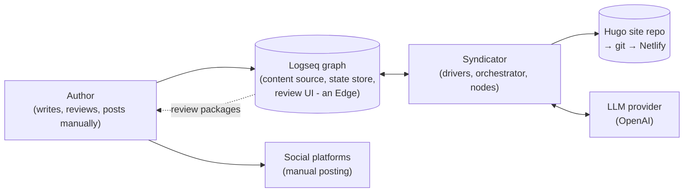
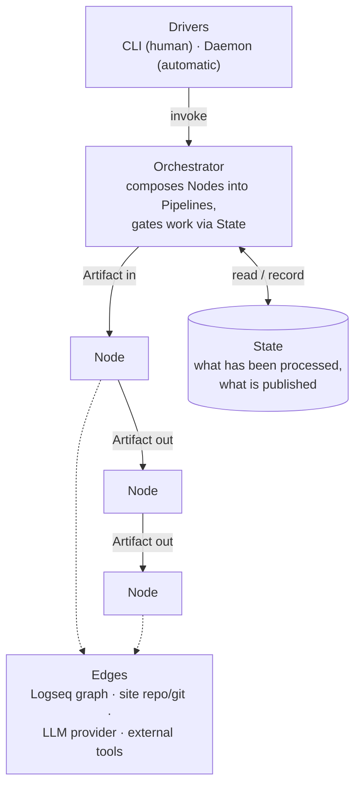
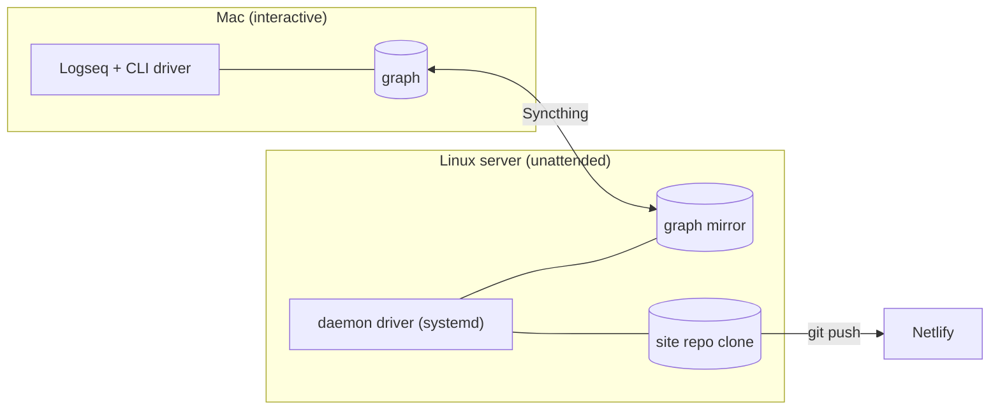

# Syndicator — Architecture (arc42)

This document describes the architecture of **Syndicator**, the publish
pipeline behind [sailingnomads.ch](https://www.sailingnomads.ch), following
the [arc42](https://arc42.org) template.

It deliberately stays on the **meta level**: it defines the concepts of the
system — *Artifact, Node, Pipeline, Orchestrator, Driver, State, Edge* — and
the rules that hold between them. Design- and operations-level documentation
(module docstrings, `README.md`, future design documents) builds on these
concepts and can reference them, e.g. *"`hugo` is a pure Node; see
architecture.md for what a Node is."* Concrete file formats, function
signatures and per-module behavior are documented in the code, not here.

Keep this document in sync when you change the architecture — not when you
add another instance of an existing concept.

---

## 1. Introduction and Goals

### 1.1 What the system does

The authors keep a diary in Logseq; some diary branches are blog posts.
Syndicator picks these up and produces everything "publishing" means for this
blog: a multilingual Hugo site (translated by LLMs, pushed via git, deployed
by Netlify), an animated journey map, and per-platform social media post
packages (AI captions, platform-adapted media). Social posts are reviewed by
a human — inside Logseq, on generated review pages — and posted manually;
flipping a status property closes the loop. Posting through platform APIs
and an agent mode are planned later phases.

The system is operated through two **drivers** with the same capabilities:

- a **CLI** (`syndicator run | catchup | bootstrap | parity | status | done |
  review | check`) for humans,
- a **daemon** (`syndicator watch`) that triggers the same pipelines
  automatically when the diary changes.

### 1.2 Quality Goals

| # | Goal | Meaning |
|---|---|---|
| 1 | **Extensibility** | New capabilities are added by creating new Nodes (or new instances of existing concepts: a channel, a language, a prompt). The concepts themselves rarely change. |
| 2 | **Flexibility** | Pipelines are composed in the Orchestrator as plain code. Recomposing nodes — a different order, a subset, a new pipeline for a new goal — is a local, low-risk change. |
| 3 | **Observability** | The interface between Nodes is observable artifacts (files on disk, logged steps). At any point you can inspect what flowed between two nodes and what the system did or would do (`--try-run`). |
| 4 | **Reliability** | Nodes can be rerun after failure. State is recorded only after work succeeded, so a crashed or failed run is repaired by simply running again; the daemon survives failures. |

### 1.3 Stakeholders

| Role | Expectation |
|---|---|
| Owner / author / operator (Benno) | Writes and reviews in Logseq; wants near-zero operational effort. |
| LLM coding agents & future contributors | Extend the system without breaking its concepts; need this document as the stable frame of reference. |

---

## 2. Architecture Constraints

| Constraint | Consequence |
|---|---|
| No workflow framework | Pipelines are plain Python function calls. There is no DAG engine, queue, scheduler — and none may be introduced. |
| Everything is files | Artifacts and state are plain files. No database, no server process besides the daemon. |
| Two machines, file sync only | A Mac (writing, review) and a Linux server (daemon) share exactly one channel: Syncthing syncing the Logseq graph folder. Locking and change detection must work within that. |
| External services at the edges | LLM provider (OpenAI), git hosting + Netlify, ffmpeg/Go tools. All replaceable; none may leak into the core. |
| Runs from a checkout | Prompts, shared config and tool binaries are resolved relative to the repo; run via `uv run syndicator …`. |

---

## 3. Context and Scope

Syndicator sits between a **content source** (the Logseq graph) and several
**publishing targets**. Everything external is attached at an edge; the core
never talks to an external system directly.

**The Logseq graph is at the very edge of this architecture.** It plays three
roles — content source, state store, review UI — but only boundary nodes
know its file format. It could be replaced (e.g. by a database and a web
review frontend) by swapping those boundary nodes; the core concepts and all
inner nodes would remain unchanged. The same holds for the other edges: Hugo
/git/Netlify could become another site generator or host, OpenAI another
model provider.

---

## 4. Solution Strategy — the meta-model

The whole system is built from seven concepts:

**Artifact** — a unit of data flowing through the system: a parsed blog
post, a media file, a caption, a rendered bundle, a review package.
Persistent artifacts are plain files; that makes every hand-off between
nodes inspectable (observability).

**Node** — the unit of processing: *artifacts in → artifacts out*. That
contract is the only interface between nodes; nodes do not know each other.
Two kinds exist:

- **Pure node**: a deterministic transformation (parse, render, plan,
  adapt, publish). Same input → same output.
- **LLM node**: defined by a prompt template, a configured model, and a
  typed output schema. Non-deterministic and costly — therefore only invoked
  when the orchestrator decides work is actually needed.

A node is realized as a small Python module with functions; there is
deliberately **no Node base class or framework** — the contract is
conceptual, not enforced by types. Rules every node obeys: side effects only
on its declared outputs, safe to rerun, no hidden state.

**Pipeline** — an ordered composition of nodes serving one goal. Pipelines
exist only as plain code in the orchestrator; creating a variant (subset,
different order, new goal) is writing a small function.

**Orchestrator** — composes pipelines, decides *what* needs processing by
comparing artifacts against recorded State (gating), runs nodes in order,
records state after success, and serializes runs (a lock). All conditional
logic lives here, none in the nodes.

**State** — the durable record of what has been processed and what is
published, stored as properties on files at the edge. State enables the two
core behaviors: *skip* (idempotency, cost control) and *rerun* (reliability).
One hard rule: content that has been published is immutable — the
orchestrator must never select it for regeneration.

**Driver** — an entry point that translates intent into orchestrator
invocations: the CLI for humans, the daemon (file watcher with debounce) for
automation. Drivers contain no processing logic.

**Edge** — a boundary where the system meets an external representation or
service. Edge knowledge (Logseq's file format, git, HTTP, ffmpeg flags,
LLM APIs) is confined to boundary nodes and adapters; the domain model in
the middle is representation-independent.

---

## 5. Building Block View

### 5.1 Concept → code map (Level 1)

| Concept | Realized in |
|---|---|
| Drivers | `cli.py` (CLI), `nodes/watch.py` (daemon) |
| Orchestrator | `pipeline.py` |
| Nodes | modules in `nodes/` (see 5.2) |
| Artifact types (domain model) | `model.py` — `BlogPost`, `Section`, `MediaRef`, `PostIntent`, `SocialDraft` |
| State | `state.py` (review-page store, lock), `backlink.py` (state on the blog source) — both are Logseq-edge implementations |
| LLM access | `llm.py` (single client: retries, structured outputs) + `prompts/` (templates) |
| Configuration | `config.py`: `syndicator.yaml` (shared, committed) + `config.local.yaml` (machine paths) |
| Edge helpers | `siteurl.py` (live-site URLs), `deploy/` (systemd unit) |

### 5.2 Node instances (Level 2)

Current nodes and the artifacts they exchange — one line each; details live
in the module docstrings:

| Node | Kind | Consumes → produces |
|---|---|---|
| `extract` | pure, edge (Logseq) | graph files → `BlogPost` artifacts |
| `hugo` | pure | `BlogPost` → Hugo page bundle |
| `translate` | LLM | bundle body → localized bundle files |
| `journeymap` | pure, edge (Go tools) | journals → journey map data + video |
| `publish_git` | pure, edge (git/Netlify) | site working tree → pushed commit, deploy confirmation |
| `social_plan` | pure | `BlogPost` → `PostIntent`s per channel |
| `caption` | LLM | `PostIntent` + post text → `SocialDraft` |
| `media_adapt` | pure + LLM assist | media file + channel spec → platform-adapted media |
| `export` | pure, edge (Logseq) | intents + drafts + media → review package (page + assets) |
| `backlink` | pure, edge (Logseq) | blog source ↔ state properties |
| `bootstrap` | pure, edge | live site + graph → initial State |

A **channel** (hugo, facebook, instagram, x, …) is not a node: it is
configuration that parameterizes nodes (media specs, caption model, prompt,
limits). Adding a channel is adding configuration plus a prompt, not code.

### 5.3 Pipeline instances

| Pipeline | Composition | Goal |
|---|---|---|
| Site | extract → hugo → translate → journeymap → publish_git | Blog post live on the website, all languages |
| Social | extract → social_plan → caption → media_adapt → export | Review-ready social post packages |
| Bootstrap | extract → (compare with live site) → state | Adopt an existing site without regenerating or LLM cost |
| Parity | extract → hugo → diff against live repo | Verify renderer output still matches production |

`run` executes site + social; driver flags (`--post`, `--site-only`,
`--social-only`, `--force`, `--try-run`) and `catchup` are recompositions or
re-parameterizations of the same nodes — examples of the flexibility goal.

---

## 6. Runtime View

### 6.1 Automatic publish (daemon)

1. The author edits the diary; Syncthing carries the change to the server.
2. The daemon driver sees file events, waits for the burst to settle
   (debounce), then invokes the orchestrator.
3. The orchestrator takes the lock, compares each post's content hash with
   recorded State, and runs the site pipeline for changed posts, then the
   social pipeline for new posts and outdated drafts.
4. State is recorded after each successful step; the review packages appear
   in the graph and sync back to the author's machine.

### 6.2 Failure and rerun

1. A node fails (LLM error after retries, broken media, failed push).
2. The run aborts (or degrades, for best-effort steps); **no state is
   recorded for unfinished work**; the daemon stays alive.
3. The next invocation — triggered by the next change, or manually — finds
   the same gap between artifacts and State and redoes exactly the missing
   work. Recovery is always "run it again".

### 6.3 Human review loop

1. The social pipeline leaves packages in `status:: draft` on review pages.
2. The author reviews in Logseq, posts manually, flips the status to
   `published`.
3. The orchestrator reads the new status on its next run: published content
   is frozen — it is never regenerated, its media never touched. Everything
   still pending forms the backlog that `catchup` works through.

---

## 7. Deployment View

- Both machines run the same checkout and can invoke any pipeline; a synced
  lock file prevents concurrent runs.
- Only the server runs the daemon (systemd unit in `deploy/`).
- All artifacts and state travel between machines exclusively through the
  synced graph — there is no other channel.
- Operations details (setup, workflows, troubleshooting): `README.md`.

---

## 8. Cross-cutting Concepts

**Observability through file artifacts.** Every node boundary is a file (or
a value immediately written to one): bundles, adapted media, review pages.
To see what the system is doing, look at the artifacts; each node execution
is also logged. `--try-run` executes pipelines for real but stops short of
going live, producing all artifacts for inspection.

**Gating and idempotency.** The orchestrator decides work by comparing
content hashes and statuses in State — never by timestamps or events alone.
Record-after-success plus atomic file writes make any interruption
recoverable by rerunning. This is also the cost-control mechanism: unchanged
content triggers zero LLM calls.

**Immutability of published content.** Once published (live on a platform),
a social post is frozen: excluded from every regeneration path, its media
untouched. No feature may violate this.

**Privacy boundary.** The diary contains private content. Only branches
explicitly marked as public blog posts enter the pipeline; nothing else may
ever reach an LLM, a bundle or an export.

**LLM node pattern.** Prompt template (versioned in `prompts/`) + model
choice (configuration) + typed output schema, all behind one client with
retries. Deterministic post-processing belongs in code, not in prompts.
Tests replace the client with a fake — nodes never know the difference.

**Extending the system.** New capability → new node (module with
artifacts-in/artifacts-out) wired into a pipeline in the orchestrator. New
publishing target → new channel configuration + caption prompt. New
language → configuration. If an extension needs a new *concept* instead of a
new *instance*, update this document first.

---

## 9. Architecture Decisions

| # | Decision | Rationale |
|---|---|---|
| 1 | Plain-code pipeline, no framework | One maintainer; debugging is reading a stack trace; flexibility lives in ordinary code. |
| 2 | State stored at the edge, inside the Logseq graph | The graph is already the sync channel and the review UI; one artifact serves all three roles. Swappable together with the edge. |
| 3 | Human review in the loop; manual posting first | Quality gate before anything goes public; platform APIs can be added later as new edge nodes without changing concepts. |
| 4 | Idempotency over transactions | With files + two machines, "safe to rerun" is achievable and sufficient; distributed transactions are not. |
| 5 | LLM nodes are configuration + prompt, not logic | Models and prompts evolve faster than code; swapping them must not require code changes. |
| 6 | Wrap proven external tools instead of porting | The journey-map Go tools and ffmpeg do their job; nodes wrap them as edges. |

---

## 10. Quality Requirements (scenarios)

| Goal | Scenario |
|---|---|
| Extensibility | A new social platform is added by writing one channel config block and one caption prompt; no orchestrator or state changes. A new processing capability is one new node module plus one line of composition. |
| Flexibility | "Site only", "one post", "redo drafts" are expressible as driver flags today; a wholly new pipeline (e.g. a newsletter) is a new composition of existing nodes. |
| Observability | After any run — real or `--try-run` — every intermediate artifact can be opened and inspected as a file; logs name each node step. |
| Reliability | Kill the process at any moment, or let any node fail: the next run completes exactly the unfinished work; published content is never touched in the process. |

---

## 11. Risks and Accepted Trade-offs

- **Sync races**: two machines editing the same state file can conflict;
  mitigated by atomic writes, a lock, and one-page-per-post granularity —
  residual conflicts are resolved manually (README, troubleshooting).
- **Advisory locking**: the lock travels via file sync and is therefore
  best-effort; idempotent nodes make a rare double-run harmless.
- **Conceptual contract is unenforced**: nodes follow the Node contract by
  convention, not by a type system; review and this document are the
  enforcement.
- **Model drift**: LLM output quality changes with provider models; prompts
  and model choices are configuration, and the human review loop is the
  safety net.

---

## 12. Glossary

Meta-level terms (the concepts of this architecture):

| Term | Definition |
|---|---|
| **Artifact** | A unit of data flowing between nodes; persistent artifacts are plain files. |
| **Node** | Unit of processing: artifacts in → artifacts out; reruns are safe; no knowledge of other nodes. |
| **Pure node** | Deterministic node. |
| **LLM node** | Node defined by prompt template + configured model + output schema; gated because non-deterministic and costly. |
| **Pipeline** | An ordered composition of nodes serving one goal; exists as plain code. |
| **Orchestrator** | Composes pipelines, gates work via state, records state, serializes runs. |
| **Driver** | Entry point invoking the orchestrator: CLI (human) or daemon (automatic). |
| **State** | Durable record of processed/published work; basis for skip and rerun decisions. |
| **Edge** | Boundary to an external system or representation (Logseq graph, git/Netlify, LLM provider, external tools); confined to boundary nodes. |
| **Channel** | Configuration describing one publishing target; parameterizes nodes, is not a node. |

Domain terms:

| Term | Definition |
|---|---|
| **Blog post** | A diary branch marked public; the root artifact of all pipelines. |
| **Section** | A titled or media-grouped part of a post; the unit that becomes one social post. |
| **Slug** | Stable identifier of a post (`<date>_<title>`); names bundles, pages, asset folders. |
| **Review package** | Generated review page + adapted media for one post; the human approval surface. |
| **Backlog** | Posts whose channels are still pending; processed one at a time via `catchup`. |
| **Published / frozen** | Content live on a platform; immutable for the system from then on. |
