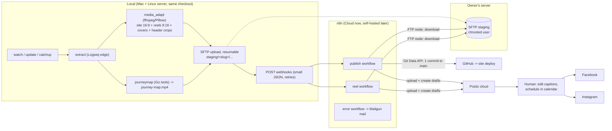

# Syndicator v2 — n8n Migration Design

**Status:** approved design, not yet implemented. Agreed 2026-07-13.
**Audience:** the implementing LLM session / developer. This document is
self-contained: all decisions are final unless marked as a *spike*, and the
rejected alternatives are listed so they are not re-proposed.

---

## 1. Goal

Replace the ~3,800-line Python pipeline with:

- a **thin local trigger** (the only part that reads the private Logseq diary),
- **three stateless n8n workflows** (all heavy lifting: translation, Hugo
  publishing, captions, social drafts),
- **Postiz cloud** as the social publishing backend and human review surface,
- an **SFTP staging area** on the owner's server as the media transport.

Simultaneously the **social strategy changes**:

- **1 intro post per blog post** (header image + platform-tailored summary,
  linking to the blog) per platform.
- **1 reel per video** in the blog post (9:16, caption related to the video).
- **No more per-section posts**, no review pages in Logseq, no content
  hashing / change detection, no scheduled-slot automation.
- Review and scheduling happen manually in the **Postiz calendar**. Nothing
  reaches a platform without the human scheduling it there.

Platforms at launch: **Facebook page + Instagram business account**.
X was dropped deliberately (little reach, risky API automation) and is done
by hand for now.

## 2. Decisions (including rejected alternatives)

| Topic | Decision | Rejected alternatives (do not re-propose) |
|---|---|---|
| Workflow engine | n8n (Cloud today, must stay compatible with self-hosted later) | — |
| Social publishing | **Postiz cloud** (~$30/mo): API + drafts + calendar UI; open-source exit hatch | Direct Meta Graph APIs (designed fully, kept as fallback: FB native scheduling + IG wait-node publish); Buffer (API closed/beta); Ayrshare ($149/mo); Blotato (closed source) |
| Review gate | Everything lands as **Postiz drafts**; human edits captions and schedules in Postiz calendar | Approval e-mails via n8n send-and-wait (works, not wanted); FB drafts in Meta planner; no gate |
| Scheduling | Manual in Postiz calendar | n8n Data Table queue + cron publisher; per-platform slot counters in workflow static data; Wait-node until slot; caller-provided datetimes |
| Media transport | **SFTP staging area on the owner's Linux server** (public IP); local uploads resumably, n8n FTP node downloads, deletes after success | Multipart webhook uploads (n8n Cloud ~200 MiB cap, no resume); Cloudinary (good fit but too big a change for now — possible later); committing reels to the site repo |
| Media adaptation | Stays **local** (existing `media_adapt`: ffmpeg + Pillow + crop-focus vision LLM). n8n Cloud cannot run ffmpeg | Cloudinary transformations |
| Reel format | **9:16**, ≤ 90 s (IG API cap), per-platform variants possible; FB/IG share one file when specs are identical | 4:5 (that is the *feed video* spec, letterboxed in reel players) |
| Reel captions | LLM caption from section text + post context + **cover frame image** (vision) | Cloudinary auto-tagging; text-only |
| Hugo site publishing | In n8n: render bundle + translate ×6 + **one commit via GitHub Git Data API** (blobs → tree → commit → ref). Push to `main` triggers the existing deploy | git CLI (n8n Cloud has no shell/persistent clone; repo working tree is media-heavy); GitLab (site repo is on **GitHub**); per-file GitHub node commits (one deploy per file) |
| Hugo markdown rendering | In n8n (Code node) from **structured blocks JSON** sent by the caller | Rendering `index.md` locally (explicitly rejected by owner) |
| journey map | Generated **locally** (Go tools), only `journey-map.mp4` ships and is committed. `data/journey.json` is an intermediate artifact — the site never reads it (verified: only `layouts/index.html` references `/journey-map.mp4`) — so it is no longer committed | Running Go tools in n8n; committing journey.json |
| Change detection | **None.** New-post marker property only; `update` re-runs everything (re-translates!) by design | hugo-hash / source-hash machinery (deleted) |
| State | Marker property on the blog post + Postiz calendar + git history. No lock file (worst case = duplicate drafts, human deletes them) | Review pages, cross-machine lock, n8n Data Tables |
| Webhook auth |  URL-as-secret | Shared-secret header `X-Syndicator-Secret` checked as first node, n8n oauth |
| Workflow versioning | None for now. n8n Cloud's built-in workflow history is enough | JSON exports in repo |
| Workflow authoring | **n8n native MCP server** (v2.13+; `validate_workflow`, `create_workflow_from_code`, `update_workflow`; works on Cloud and self-hosted) | Hand-written JSON imports |
| Clean up FTP files | User does it by hand | Delete after successful workflow run |

## 3. Target architecture



Responsibilities:

- **Local** is the only component reading the diary. Privacy boundary: only
  `type:: blog` + `status:: online` branches ever leave the machine.
- **n8n** is stateless; every execution starts, runs minutes, ends. No Wait
  nodes, no static data, no queues.
- **Postiz** holds the Meta OAuth tokens (its cloud apps — no own Meta
  developer app needed) and is the only thing that talks to the platforms.
- **GitHub** push to `main` triggers the existing site deploy (unchanged).

## 4. Contracts

### 4.1 SFTP staging area

- Server: owner's Linux server (public), dedicated chrooted key-only user
  (`syndicator-sftp`, `ForceCommand internal-sftp`). Two keypairs: one for
  local, one for the n8n FTP credential.
- Local uploads **resumably** (lftp or paramiko with offset resume; must work
  through `internal-sftp`, so no rsync) and **overwrites on retry** — uploads
  are idempotent.
- Workflows download what the manifest names

### 4.2 Webhooks

Both webhooks: `POST`, `Content-Type: application/json`. The workflow responds immediately with `{"status":"accepted"}` (respond-early node) and continues async.
Local client: 3 retries with backoff.

**`POST /publish`** — one call per blog post:

```jsonc
{
  "slug": "2026-07-05_Titel",
  "meta": { "title": "…", "date": "2026-07-05", "language": "german",
            "lang_code": "de", "author": "…", "summary": "…", "position": "…" },
  "post_url": "https://www.sailingnomads.ch/de/posts/2026-07-05_titel/",
  "blocks": [
    { "kind": "title", "raw": "## …", "heading_level": 2 },
    { "kind": "text",  "raw": "…" },
    { "kind": "media", "media": { "kind": "image", "bundle_filename": "x.jpg",
                                   "sftp_path": "2026-07-05_Titel/site/x.jpg", "alt": "…" } },
    { "kind": "youtube", "media": { "kind": "youtube", "youtube_id": "…" } }
  ],
  "site_media": [
    { "sftp_path": "2026-07-05_Titel/site/x.jpg",  "bundle_filename": "x.jpg" },
    { "sftp_path": "2026-07-05_Titel/site/v1.mp4", "bundle_filename": "v1.mp4" },
    { "sftp_path": "2026-07-05_Titel/site/featured.jpg", "bundle_filename": "featured.jpg" },
    { "sftp_path": "2026-07-05_Titel/journey-map.mp4", "repo_path": "static/journey-map.mp4" }
  ],
  "header": {
    "facebook":  { "sftp_path": "2026-07-05_Titel/header/facebook.jpg" },
    "instagram": { "sftp_path": "2026-07-05_Titel/header/instagram.jpg" }
  },
  "flags": { "redeploy": false }   // update: redeploy true otherwise false. If redeploy ony recreate hugo and deploy
}
```

When a post has a header image, `site_media` includes its Hugo bundle variant
as `featured<ext>`; `header.facebook` and `header.instagram` are the separate
social crops.

**`POST /reel`** — one call per video in the post (independent of /publish):

```jsonc
{
  "slug": "2026-07-05_Titel",
  "post": { "title": "…", "url": "https://…", "summary": "…", "lang_code": "de" },
  "video": { "index": 1, "section_title": "…", "section_text": "…", "alt": "dingy.mp4" },
  "files": {
    "reels": { "facebook": "2026-07-05_Titel/reels/1.mp4",
               "instagram": "2026-07-05_Titel/reels/1.mp4" },   // same path = shared file
    "cover": "2026-07-05_Titel/covers/1.jpg"
  }
}
```

### 4.3 Marker property (replaces all hashing)

- New property on the blog property block: `syndicated-at:: <ISO datetime>`,
  written by the local client after **all** webhooks for the post were
  accepted.

## 5. Local CLI v2

Commands (Typer, as today):

| Command | Behavior |
|---|---|
| `watch` | Daemon (existing watchdog + debounce). New online post without marker → full flow: adapt media → journeymap → SFTP upload → N× `/reel` → `/publish` (flags both true) → set marker |
| `redeploy --post SLUG` | Force site redeploy: site media + journeymap → SFTP → `/publish` with `redeploy: true`. No marker logic. Re-translates by design |
| `check` | Kept, trimmed: config, ffmpeg, SFTP reachability, OPENAI_API_KEY |


## 6. n8n workflows

Built via the **n8n MCP server** (validate → create → iterate). All 
workflows get the error workflow assigned. Guardrails: process files
**sequentially within each execution** (memory: base64 of a ~25 MB video is
fine one at a time); separate `/reel` webhook executions may still run
concurrently under the n8n Cloud instance's concurrency limit. FTP node in
SFTP mode.

**publish** (webhook `/publish`):
1. Respond `{"status":"accepted"}`.
2. Code node renders the source-language `index.<lang>.md`
   from `blocks` (port of old `hugo.py`: TOML front matter; media blocks →
   `` / `` / ``).
3. Translate into the other languages + pirate (OpenAI node per language,
   prompts ported from `prompts/translate.md` / `translate_pirate.md`,
   pirate derived from the English version; language list + disclaimers from
   old `config.py::_BUILTIN_LANGUAGES`).
4. Loop `site_media` sequentially: FTP download → GitHub `POST /git/blobs`
   (base64, ≤100 MB/blob). Then one tree (`base_tree` = current `main` tree,
   entries for all `index.*.md` + media under `content/posts/<slug>/` +
   `static/journey-map.mp4`) → one commit → `PATCH refs/heads/main`.
5. If not `flags.redeploy = true`: intro captions per platform (OpenAI; prompts derived
   from `prompts/caption_facebook.md` / `caption_instagram.md`, reworked for
   "summary of the whole post, drive readers to the blog"; inline the
   `_human_voice.md` rules into each prompt — n8n has no includes).
6. If not `flags.redeploy = true`: Upload header images to Postiz `/upload`, create **draft** posts (FB + IG integrations) via Postiz `/posts`.

**reel** (webhook `/reel`):
1. Respond `{"status":"accepted"}`.
2. FTP download reel file + cover.
3. Captions per platform (OpenAI vision: cover image + section text + post
   context; prompt derived from the old per-section caption prompts, goal =
   subscriber growth, relate to the video).
4. Postiz `/upload` (once per distinct file), `/posts` type **draft**, FB +
   IG entries with platform settings (`__type: facebook` / `instagram`,
   `post_type` for reels — see spike).

**error**: Error Trigger → Mailgun SMTP mail (workflow name, error message,
execution URL).

### Spikes before building (≤ 30 min total)

1. **Postiz reel semantics**: upload a test video manually via API — does an
   IG video draft become a proper Reel (`post_type`, `is_trial_reel`
   fields exist in the API schema)? What does a FB video draft post as
   (video vs. reel)? Fallback if FB reels unsupported: regular FB video
   post now, direct FB `/video_reels` branch later.
2. **Postiz draft type**: confirm `type: "draft"` in `POST /public/v1/posts`
   and how drafts appear/schedule in the calendar. Rate limit: 30 req/h —
   fine (a post ≈ 2 uploads + a handful of creates).
3. **n8n FTP node**: SFTP + private key against the staging server; download of a ~50 MB file.

## 7. Verified facts & constraints (do not re-research)

- **GitHub Git Data API**: multi-file single commit = blobs (base64,
  ≤100 MB each) → tree → commit → update ref. API-created commits trigger
  deploys normally.
- **n8n Cloud**: no env vars, no Execute Command, no ffmpeg, no persistent
  disk; webhook multipart limit ~200 MiB total (moot with SFTP); FTP node is
  a **client** (FTP+SFTP); binary ops must be sequenced for memory.
- **n8n MCP** (v2.13+, Cloud & self-hosted): `search/validate/create/update`
  workflow tools; workflows must be explicitly MCP-enabled in settings.
- **Postiz public API**: `Authorization: <api-key>` header;
  `POST /public/v1/upload` (multipart) → media id; `POST /public/v1/posts`
  with `type` (`draft`/`schedule`/`now`), `posts[].integration.id`,
  per-platform `settings.__type`; 30 requests/hour; cloud base
  `https://api.postiz.com/public/v1`. Self-hosted Postiz would require an
  own Meta app (that's why cloud, for now).
- **Instagram** (via Postiz, but relevant to specs): reels ≤90 s via API,
  9:16; feed images 4:5 max portrait.
- **Meta APIs direct** (fallback only): FB reels `/page/video_reels` with
  `video_state=SCHEDULED` + `scheduled_publish_time` (10 min–29 d); IG has
  **no** native scheduling (publish-at-moment via container flow).
- n8n send-and-wait approval exists on the plain **SMTP Send Email node**
  (works with Mailgun SMTP; no Gmail needed) — designed, then dropped in
  favor of Postiz drafts. Keep in mind if a review gate is ever wanted again.

## 8. Prerequisites (owner provides)

1. SFTP user on the Linux server (chroot, key-only; commands were provided)
   → host, port, username, both keypairs.
3. n8n credentials: OpenAI key · GitHub fine-grained PAT (`contents:
   read/write` on the sailingnomads repo) · Mailgun SMTP · SFTP (host +
   key) · Postiz API key.
4. Postiz cloud account with FB page + IG account connected.

## 9. Implementation plan

Delegate to cheap subagents where possible; the orchestrating session owns
contracts and review.

## 10. Non-goals (explicitly rejected — do not add)

- No workflow framework locally; no queues, cron publishers, Data Tables.
- No completion callbacks from n8n to local (no state coupling); failure
  handling = error mail .
- No skip-if-unchanged logic in n8n (that's hashing through the back door).
- No scheduling automation on top of Postiz (its calendar is the queue).
- No Cloudinary, no X automation, no Meta developer app — all "maybe later".
- Optional nicety (only if the owner asks): 3-node dead-man's-switch
  workflow (mail if no publish webhook for ~3 weeks).
