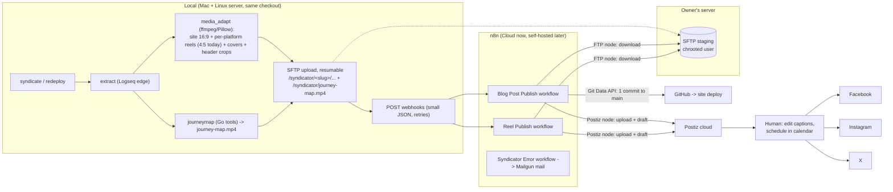

# Syndicator v2 — n8n Migration Design

**Status:** implementation in progress. Agreed 2026-07-13. As of 2026-07-18:
Phases 1–3 and 5 are done — the local trigger (`syndicate`/`redeploy`), the
media/transport/contract code and the docs are on the `n8n-migration` branch,
and the three n8n workflows (`Syndicator Error`, `Blog Post Publish`,
`Reel Publish`) are **created inactive** via the MCP server. **Owner still to
do (Phase 4 + wiring):** publish `Syndicator Error` and set it as
`settings.errorWorkflow` on the other two; select the `GitHub account`
credential on the six GitHub HTTP Request nodes in `Blog Post Publish` (not
auto-assigned); smoke-test each workflow; activate the production webhooks and
copy their URLs into `syndicator.yaml`; hand-seed `syndicated-at::` on existing
online posts; then run the first real batch. Mark this doc *implemented* once
that is done in production.
**Audience:** the implementing LLM session / developer. This document is
self-contained: all decisions are final unless marked as a *spike*, and the
rejected alternatives are listed so they are not re-proposed.

---

## 1. Goal

Replace the ~3,800-line Python pipeline with:

- a **thin local trigger** (the only part that reads the private Logseq diary),
- **three stateless n8n workflows** (all heavy lifting: translation, Hugo
  publishing, captions, social drafts),
- **Postiz cloud** as the social publishing backend and human review surface,
- an **SFTP staging area** on the owner's server as the media transport.

Simultaneously the **social strategy changes**:

- **1 intro post per blog post** (header image + platform-tailored English
  summary) per platform.
- **1 reel per video** in the blog post (captions in English too).
- **Link placement:** Facebook captions include the blog URL. Instagram and
  X do **not** — IG cannot put clickable links in the post; X omits links
  because they reduce reach. Both use a bio CTA instead (same idea as today's
  IG `link_mode: bio`).
- **No more per-section posts**, no review pages in Logseq, no content
  hashing / change detection, no scheduled-slot automation.
- New property on the blog property block: `syndicated-at:: <ISO datetime>`,
  written by the local client after **all** webhooks for the post were
  accepted. This marks **handoff, not completion** (the workflows respond
  early and run async) — see §6 *Failure & recovery*. Existing online posts
  are **seeded by hand** before the first batch `syndicate` (no automated
  backfill).
- Review and scheduling happen manually in the **Postiz calendar**. Nothing
  reaches a platform without the human scheduling it there.
- Local CLI runs on **Mac first**; must stay **Linux-compatible** (same
  checkout/tools on the server later).

Platforms at launch: **Facebook page + Instagram business account + X**.

## 2. Decisions (including rejected alternatives)

| Topic | Decision | Rejected alternatives (do not re-propose) |
|---|---|---|
| Workflow engine | n8n (Cloud today, must stay compatible with self-hosted later) | — |
| Social publishing | **Postiz cloud** (~$30/mo): drafts + calendar UI; open-source exit hatch | Direct Meta Graph APIs (designed fully, kept as fallback: FB native scheduling + IG wait-node publish); Buffer (API closed/beta); Ayrshare ($149/mo); Blotato (closed source) |
| Postiz in n8n | **Community node** [`n8n-nodes-postiz`](https://www.npmjs.com/package/n8n-nodes-postiz) (`n8n-nodes-postiz.postiz`): `uploadFile`, `createPost`, `getIntegrations` — thin wrapper over the public API, same limits | Raw HTTP Request to `/public/v1/*` (works but more boilerplate; no upload-size advantage) |
| Review gate | Everything lands as **Postiz drafts**; human edits captions and schedules in Postiz calendar | Approval e-mails via n8n send-and-wait (works, not wanted); FB drafts in Meta planner; no gate |
| Scheduling | Manual in Postiz calendar | n8n Data Table queue + cron publisher; per-platform slot counters in workflow static data; Wait-node until slot; caller-provided datetimes |
| Media transport | **SFTP staging area on the owner's Linux server** (public IP); local uploads resumably, n8n FTP node downloads (never deletes) | Multipart webhook uploads (n8n Cloud ~200 MiB cap, no resume); Cloudinary (good fit but too big a change for now — possible later); committing reels to the site repo |
| Media adaptation | Stays **local** (existing `media_adapt`: ffmpeg + Pillow + crop-focus vision LLM). n8n Cloud cannot run ffmpeg. **Reel (and header) specs stay per-channel** in `syndicator.yaml` (`reel_video` / `image`); at launch FB + IG + X all use **4:5** `1080×1350` (X gains a `reel_video` block). Sharing is by **full `VideoSpec` equality** (aspect, size, `max_seconds`, …), not aspect alone: if the source is short enough that every platform's adapt would be identical, one file and repeated `sftp_path`s; if e.g. the source is longer than IG's 90 s but within FB's 240 s, local produces a separate trimmed IG reel and only IG's path points at it. The `/reel` contract always carries **per-platform** `sftp_path`s so a later platform (e.g. TikTok 9:16) can diverge without contract changes | One global reel aspect for all platforms; Cloudinary transformations |
| Reel captions | LLM caption from section text + post context + **cover frame image** (vision) | Cloudinary auto-tagging; text-only |
| Hugo site publishing | In n8n: render source-language index + translate into the **other** languages (6 codes: `en`/`de`/`es`/`fr`/`it`/`arrr`) + **one commit via GitHub Git Data API** (blobs → tree → commit → ref). Push to `main` triggers the existing deploy. **English is translated at most once** and reused for both `index.en.md` and as the sole input to pirate (`arrr`); never a second source→en pass for pirate | git CLI (n8n Cloud has no shell/persistent clone; repo working tree is media-heavy); GitLab (site repo is on **GitHub**); per-file GitHub node commits (one deploy per file); six LLM translates including the source; separate English translate just for pirate |
| Hugo markdown rendering | In n8n (Code node) from **structured blocks JSON** sent by the caller | Rendering `index.md` locally (explicitly rejected by owner) |
| journey map | Generated **locally** (Go tools), only `journey-map.mp4` ships and is committed. Global (whole trip), so generated **once per invocation** and referenced in each `/publish`'s `site_media`. The render is **deterministic** (frames from Go with no rand/time; fixed ffmpeg `libx264 -crf 23`, no `creation_time`) → byte-identical output when travel is unchanged, so git content-addressing dedupes the blob and re-committing it every publish causes **no repo bloat**; a new blob appears only when positions change. `data/journey.json` is an intermediate artifact — the site never reads it (verified: only `layouts/index.html` references `/journey-map.mp4`) — so it is no longer committed. Do not add change-detection state around it — determinism already makes it free | Running Go tools in n8n; committing journey.json; hashing to skip regeneration |
| Change detection | **None.** New-post marker property only; `redeploy` re-runs the whole site build (re-translates!) by design | hugo-hash / source-hash machinery (deleted) |
| State | Marker property on the blog post + Postiz calendar + git history. No lock file (worst case = duplicate drafts, human deletes them) | Review pages, cross-machine lock, n8n Data Tables |
| Webhook auth | URL-as-secret | Shared-secret header `X-Syndicator-Secret` checked as first node, n8n oauth |
| Workflow versioning | None for now. n8n Cloud's built-in workflow history is enough | JSON exports in repo |
| Workflow authoring | **n8n native MCP server** (v2.13+; `validate_workflow`, `create_workflow_from_code`, `update_workflow`; works on Cloud and self-hosted). Workflows **created via MCP are MCP-enabled automatically**; workflows created in the UI must be MCP-enabled manually in settings | Hand-written JSON imports |
| Prompts & models (cloud LLM steps) | Ported once from `prompts/` into the n8n OpenAI nodes; thereafter the **n8n copies are authoritative** for the cloud steps (translate, captions) — divergence from `prompts/` is accepted. `prompts/` + `syndicator.yaml` stay canonical only for LLM use that remains local (`media_adapt` crop-focus). Model names for cloud steps live on the n8n OpenAI nodes | Keep `prompts/`/`syndicator.yaml` canonical and sync into n8n (rejected: no include mechanism in n8n, constant drift) |
| Clean up FTP files | **Nobody deletes automatically.** Re-runs overwrite in place (idempotent uploads); the owner purges the staging area periodically by hand (optionally a cron `find -mtime` purge) | Delete after successful workflow run (unsafe: `/publish` and `/reel` are separate executions sharing files under `<slug>/`) |

## 3. Target architecture



Responsibilities:

- **Local** is the only component reading the diary. Privacy boundary: only
  `type:: blog` + `status:: online` branches ever leave the machine.
- **n8n** is stateless; every execution starts, runs minutes, ends. No Wait
  nodes, no static data, no queues.
- **Postiz** holds the platform OAuth tokens (Meta and X, via its cloud
  apps — no own developer apps needed) and is the only thing that talks to
  the platforms.
- **GitHub** push to `main` triggers the existing site deploy (unchanged).

## 4. Contracts

### 4.1 SFTP staging area

Proof Of Concept: See n8n Workflow 'SFTP Test'

- Server: owner's Linux server (public), dedicated chrooted key-only user
  (`sftp`).
- IP address 144.2.110.132 port 22
- Local upload: Key for user sftp provided in .ssh, connect with sftp syncthing-central-sftp
- n8n: SFTP credentials configured
- **Base directory `/syndicator/`** inside the chroot (create once). Every
  `sftp_path` in the webhook contracts is **chroot-absolute and passed
  verbatim** to both the local uploader and the n8n FTP node — no prefixing
  logic anywhere. Per-post layout:

  ```
  /syndicator/
    journey-map.mp4    global map, uploaded once per invocation, shared by every post
    <slug>/
      site/            site bundle media (images, videos, featured<ext>)
      header/          social header crops (facebook.jpg, instagram.jpg, x.jpg)
      reels/           reel videos — one dir per distinct adapt
                       (e.g. 4x5/1.mp4 today; tiktok/1.mp4 if 9:16 later)
      covers/          matching cover frames (same dir naming as reels)
  ```

  Reels and covers are **keyed by platform in the webhook**, because channel
  `reel_video` is a full per-channel `VideoSpec` in `syndicator.yaml`
  (aspect, size, `max_seconds`, …). Local adapts **once per distinct
  effective spec** and may reuse one uploaded file across platforms only
  when those adapts would be identical. At launch all three use **4:5
  1080×1350**, but IG's `max_seconds` is **90** while FB's is **240** (X
  gets its own `reel_video` with its limit). So: source ≤ 90 s → one file
  (e.g. `reels/4x5/1.mp4`) and the same `sftp_path` for every platform;
  source > 90 s → a separate IG-trimmed file (and matching cover) with only
  `files.reels.instagram` / `files.covers.instagram` pointing at it; FB/X
  keep the longer adapt when their specs allow. A future channel with a
  different aspect (e.g. TikTok 9:16) is the same rule — own file, own
  path. Webhook paths are authoritative — the directory names above are a
  local convention.

- Local uploads **resumably** (lftp or paramiko with offset resume; must work
  through `internal-sftp`, so no rsync) and **overwrites on retry** — uploads
  are idempotent.
- Workflows download what the manifest names; they **never delete** from the
  staging area (files are shared across the independent `/publish` and `/reel`
  executions). Cleanup is manual/periodic on the server — see §2.

### 4.2 Webhooks

Proof Of Concept: See n8n Workflow 'Tagesbriefing'

Both webhooks: `POST`, `Content-Type: application/json`. The workflow responds immediately with `{"status":"accepted"}` (respond-early node) and continues async.
Local client: 3 retries with backoff.

**`POST /publish`** — one call per blog post:

```jsonc
{
  "slug": "2026-07-05_Titel",
  "meta": { "title": "…", "date": "2026-07-05", "language": "german",
            "lang_code": "de", "author": "…", "summary": "…", "position": "…" },
  "post_url": "https://www.sailingnomads.ch/de/posts/2026-07-05_titel/",
  "blocks": [
    { "kind": "title", "raw": "## …", "heading_level": 2 },
    { "kind": "text",  "raw": "…" },
    { "kind": "media", "media": { "kind": "image", "bundle_filename": "x.jpg",
                                   "sftp_path": "/syndicator/2026-07-05_Titel/site/x.jpg", "alt": "…" } },
    { "kind": "media", "media": { "kind": "video", "bundle_filename": "v1.mp4",
                                   "sftp_path": "/syndicator/2026-07-05_Titel/site/v1.mp4", "alt": "…" } },
    { "kind": "youtube", "media": { "kind": "youtube", "youtube_id": "…" } }
  ],
  "site_media": [
    { "sftp_path": "/syndicator/2026-07-05_Titel/site/x.jpg",  "bundle_filename": "x.jpg" },
    { "sftp_path": "/syndicator/2026-07-05_Titel/site/v1.mp4", "bundle_filename": "v1.mp4" },
    { "sftp_path": "/syndicator/2026-07-05_Titel/site/featured.jpg", "bundle_filename": "featured.jpg" },
    { "sftp_path": "/syndicator/journey-map.mp4", "repo_path": "static/journey-map.mp4" }
  ],
  "header": {
    "facebook":  { "sftp_path": "/syndicator/2026-07-05_Titel/header/facebook.jpg" },
    "instagram": { "sftp_path": "/syndicator/2026-07-05_Titel/header/instagram.jpg" },
    "x":         { "sftp_path": "/syndicator/2026-07-05_Titel/header/x.jpg" }
  },
  "flags": { "redeploy": false }   // `redeploy` command sets true; `syndicate` sets false. If true: only re-render + commit the site (skip captions/drafts — see §6 steps 5-6)
}
```

When a post has a header image, `site_media` includes its Hugo bundle variant
as `featured<ext>`; `header.facebook`, `header.instagram` and `header.x` are
the separate social crops.

**Block rendering (verified against the `sailingnomads` repo, 2026-07-18).**
The local side ships **Hugo-ready** content: `raw` for `title`/`text` blocks is
already clean markdown with all Logseq asset references rewritten to bundle
basenames (the `hugo.py::transform_content` logic — `../assets/…` → flattened
name, adapted filenames, `{{video}}` → shortcode — stays **local**). The n8n
Code node is a thin emitter that does **no** Logseq parsing:

| Block | Emits | Confirmed by |
|---|---|---|
| `title` / `text` | `raw` verbatim | production `index.*.md` |
| `media` `image` | `` | `layouts/_default/_markup/render-image.html` resolves the basename via `Page.Resources.GetMatch` |
| `media` `video` | `` | custom `layouts/shortcodes/video.html` |
| `youtube` | `` | Hugo built-in (no override) |

Front matter is the TOML `+++` block built from `meta` exactly as
`hugo.py::front_matter` does today (`date`, `lastmod=date`, `draft=false`,
`title`, `summary`, `[params] author`). Inline media embedded *inside* a `text`
paragraph stays inline in that block's (pre-cleaned) `raw`; its file is still
listed in `site_media` so it is downloaded and committed — `site_media` is the
authoritative media manifest for the commit, independent of `blocks`. Media
lives once in the leaf bundle (`content/posts/<slug>/`) and every language
`index.*.md` shares those resources (the video shortcode resolves relative to
the default-language page).

**Featured image is mandatory.** The site build **errors** if a post bundle
has no `featured*`/`cover*` image resource and no `params.featured_image`
(`layouts/_partials/func/GetFeaturedImageMeta.html` +
`layouts/page.postcontent.xml`). So `site_media` must always include a
`featured<ext>` variant, and a post with no `header::` also has no intro
social post (the intro is built from the header crops). Therefore the local
client **enforces a header up front**: a `status:: online` post without a
`header::` image is refused before any media adaptation, upload or webhook —
no marker is set. In batch `syndicate` the offending post is reported and
skipped; the others continue. The author adds a header and re-runs.

**`POST /reel`** — one call per video in the post (independent of /publish).
`files.reels` and `files.covers` are **always keyed by platform**. Identical
path strings mean a shared file (allowed when full `VideoSpec` adapts
coincide — e.g. source ≤ 90 s); different paths mean distinct adapts (e.g.
IG 90 s trim vs longer FB). Example when all three share:

```jsonc
{
  "slug": "2026-07-05_Titel",
  "post": { "title": "…", "url": "https://…", "summary": "…", "lang_code": "de" },
  "video": { "index": 1, "section_title": "…", "section_text": "…", "alt": "dingy.mp4" },
  "files": {
    // launch: one shared 4:5 adapt — same path repeated. Later e.g. tiktok
    // can use ".../reels/9x16/1.mp4" for that key only, without changing shape.
    "reels": { "facebook": "/syndicator/2026-07-05_Titel/reels/4x5/1.mp4",
               "instagram": "/syndicator/2026-07-05_Titel/reels/4x5/1.mp4",
               "x": "/syndicator/2026-07-05_Titel/reels/4x5/1.mp4" },
    "covers": { "facebook": "/syndicator/2026-07-05_Titel/covers/4x5/1.jpg",
                "instagram": "/syndicator/2026-07-05_Titel/covers/4x5/1.jpg",
                "x": "/syndicator/2026-07-05_Titel/covers/4x5/1.jpg" }
  }
}
```

## 5. Local CLI v2

Commands (Typer, as today):

| Command | Behavior |
|---|---|
| `syndicate [--post SLUG]` | No args: every `status:: online` blog post **without** a `syndicated-at` marker. The global journey map is generated + uploaded **once per invocation** (not per post); then per post: adapt media → SFTP upload → N× `/reel` → `/publish` (`redeploy: false` → site **and** intro drafts; each `/publish`'s `site_media` references the shared `journey-map.mp4`) → set marker. `--post SLUG`: only that post. Already-marked posts are skipped (immutability — re-running would create duplicate drafts). **Precondition: a `header::` image is required** — a post without one is refused before any work (no marker); in batch mode it is reported and skipped, others continue. **Cutover:** the owner hand-seeds `syndicated-at::` on already-published online posts before the first batch run |
| `redeploy --post SLUG` | Force site redeploy: site media + journeymap → SFTP → `/publish` with `redeploy: true`. No social, no marker logic. Re-translates by design |

Drop **all** other current commands and the daemon: `watch`, `run`, `catchup`,
`status`, `done`, `review`, `parity`, `check`, `bootstrap` and the systemd
service support are removed. Only `syndicate` and `redeploy` remain.

Runs on **Mac initially**; implementation must stay **Linux-compatible** (same
Python/ffmpeg/Go/SFTP toolchain) so the server can run it later.


## 6. n8n workflows

**Create three new n8n workflows via the MCP server:**

| Workflow | Trigger | Role |
|---|---|---|
| `Blog Post Publish` | webhook `/publish` | render + translate + GitHub commit + intro drafts |
| `Reel Publish` | webhook `/reel` | one reel → Postiz drafts |
| `Syndicator Error` | Error Trigger | Mailgun failure mail; assigned to the other two |

Built via the **n8n MCP server** (`validate_workflow` →
`create_workflow_from_code` → iterate with `update_workflow`). Workflows
**created by MCP are MCP-enabled automatically**; any workflow created in the
n8n UI must be MCP-enabled manually in settings. `Syndicator Error` must be
**created and published first**, then assigned to the other two via each
workflow's `settings.errorWorkflow` (n8n rejects the assignment if the target
has no published version or no Error Trigger). Guardrails: process files
**sequentially within each execution** (memory: base64 of a ~25 MB video is
fine one at a time); separate `/reel` webhook executions may still run
concurrently under the n8n Cloud instance's concurrency limit. FTP node in
SFTP mode.

**Postiz create budget.** Each operation creates **one independent
single-channel draft per platform** (so each can be scheduled/edited on its
own), i.e. 3 `createPost` calls per operation. A post with V videos therefore
costs `3 × (V + 1)` creates (intro + reels); e.g. 5 videos → 18. `uploadFile`
is separate from the 30-creates/hour limit. **Accepted as-is for now** — fine
for a single post; a large first batch `syndicate` across many pending posts
could exceed 30/h. If that happens the 429 surfaces via the error mail and the
owner re-runs; raising the limit (or adding node-level retry/backoff) is a
future step, not built now.

**`Blog Post Publish`** (webhook `/publish`):
1. Respond `{"status":"accepted"}`.
2. Code node assembles the source-language `index.<lang>.md` from `blocks` —
   a thin emitter (front matter + verbatim `raw` + structured media), **no
   Logseq parsing**; the `hugo.py` media-rewriting stays local. Exact rules and
   the sailingnomads verification are in §4.2 *Block rendering*.
3. Translate into every supported language **except the source** (six codes
   `en`/`de`/`es`/`fr`/`it`/`arrr` from `config.py::_BUILTIN_LANGUAGES` /
   `syndicator.yaml`; do **not** re-translate the source index from step 2).
   Prompts ported from `prompts/translate.md` / `translate_pirate.md` — once
   ported, the n8n copies are authoritative, see §2. **Wire English once,
   then pirate off that result** (same as v1 `translate_bundle`):

   - If source is not `en`: one OpenAI node source→English; that output is
     both `index.en.md` **and** the input to the pirate node. Do **not**
     call source→en a second time for `arrr`.
   - If source is already `en`: skip the English node; pirate reads the
     source body from step 2.
   - Pirate: one OpenAI node English→`arrr` (`translate_pirate.md`).
   - Other targets (`es`/`fr`/`it`/… except source): OpenAI source→target
     in parallel with the English node (they do not depend on it).
   - Append each target's disclaimer. Typical German source → **4** direct
     translates (`en`/`es`/`fr`/`it`) + **1** pirate = 5 body LLM calls.
4. Loop `site_media` sequentially: FTP download → GitHub `POST /git/blobs`
   (base64, ≤100 MB/blob). Then one tree (`base_tree` = current `main` tree,
   entries for all `index.*.md` + media under `content/posts/<slug>/` +
   `static/journey-map.mp4`) → one commit → `PATCH refs/heads/main`.
   **Orphans accepted (matches v1):** `base_tree` only adds/overwrites, never
   deletes, so a removed/renamed/re-extensioned asset or a dropped language
   leaves a stale file in the bundle. These never reach the live site (Hugo
   only publishes *referenced* bundle resources) — they only bloat the repo.
   Known edge case: if a header image's *extension* changes, both
   `featured.<old>` and `featured.<new>` coexist and `GetMatch
   "**{feature,cover}*"` may pick either; avoid by keeping the header
   extension stable (or clean the bundle by hand).
5. If not `flags.redeploy = true`: intro captions per platform (OpenAI;
   **always English**; prompts derived from `prompts/caption_facebook.md` /
   `caption_instagram.md`, reworked for "summary of the whole post"; a new X
   prompt in the same style, respecting the X length limit; inline the
   `_human_voice.md` rules into each prompt — n8n has no includes).
   **Link rules:** Facebook caption includes `post_url`. Instagram and X
   captions do **not** include a URL — bio CTA only (IG cannot link; X links
   hurt reach).
6. If not `flags.redeploy = true`: **one independent draft per platform** —
   for each of FB / IG / X: SFTP download that platform's header crop →
   **Postiz `uploadFile`** → **one single-channel Postiz `createPost`**
   (`type: draft`, one `posts.post[]` entry: that integration ID + caption +
   uploaded `id`/`path` in content `image` array, `settings.__type:
   facebook` / `instagram` / `x`). The node's date field is required even for
   drafts — set it to **tomorrow** (UTC date of `now + 1 day`); the human
   reschedules in the Postiz calendar. Separate calls (not one grouped
   multi-channel post) so each platform is its own draft to schedule/edit.
   For **X** also set `who_can_reply_post: everyone` (mandatory — see spike 4);
   for FB set `post_type: post`. → 3 uploads + **3 creates**.

**`Reel Publish`** (webhook `/reel`):
1. Respond `{"status":"accepted"}`.
2. For each distinct `files.reels.*` / `files.covers.*` path: FTP download
   once (dedupe by path — shared when full-spec adapts coincide; separate
   when e.g. IG is the 90 s trim).
3. Captions per platform (OpenAI vision: that platform's cover image +
   section text + post context; **English**; prompt derived from the old
   per-section caption prompts, goal = subscriber growth, relate to the
   video). Same link rules as intro: no URL on IG/X; FB may include
   `post.url` if the prompt calls for it.
4. For each platform: **Postiz `uploadFile`** of that platform's reel
   (reuse a prior upload `id`/`path` when another platform already uploaded
   the same SFTP file in this execution; cover only if needed as separate
   media) → **one single-channel Postiz `createPost`** (FB, IG, X). Draft
   date = **tomorrow** (same as `/publish` intros). Separate calls (not one
   grouped multi-channel post) so each platform is its own draft to
   schedule/edit. Per-platform `settings`: for both FB and IG set
   `post_type: post`; for IG also set `is_trial_reel: false`; for X set
   `who_can_reply_post: everyone` (mandatory — see spike 4). The uploaded MP4
   makes these video posts Reels — `post_type: reel` is not a valid value.
   Include the matching `__type` for every platform. → 1 upload + **3
   creates** when all paths coincide; more uploads if paths diverge. If
   settings prove too awkward in the node UI, fall back to a Code node
   building the JSON body + HTTP Request to `POST /public/v1/posts` for that
   step only.

**`Syndicator Error`**: Error Trigger → Mailgun SMTP mail (workflow name,
error message, execution URL — intentionally minimal). Created and
**published** first, then set as `settings.errorWorkflow` on `Blog Post
Publish` and `Reel Publish`. Note: the assigned error workflow fires only for
**production** executions (not manual MCP test runs).

### Failure & recovery

The `syndicated-at` marker means **handed off**, not **published**: the local
client writes it once all webhooks returned `{"status":"accepted"}`. Because
the workflows respond early and run async — and there are no completion
callbacks (§10) — a workflow that fails *after* acceptance leaves the post
marked. Recovery is out-of-band, by failure class:

- **Handoff failure** (a webhook never returns accepted after the local 3
  retries): the marker is *not* written, so the next `syndicate` re-runs the
  whole post. Duplicates are harmless (site commit is idempotent; duplicate
  drafts are deleted by hand).
- **Site async failure** (`Blog Post Publish` render / translate / commit):
  run `redeploy --post SLUG` — it ignores the marker and re-runs the site
  only.
- **Social async failure** (Postiz drafts, in `/publish` step 6 or
  `Reel Publish`): **no CLI path by design.** The owner re-runs the failed
  execution in n8n (the error mail's execution URL → the execution's input
  payload names the slug) or fixes the draft directly in Postiz. `redeploy`
  will not help (site-only) and `syndicate` skips the marked post.

The execution URL in the error mail is the entry point for all manual
recovery.

### Postiz node

Proof of Concept: n8n Workflows 'Postiz Test' (FB + IG reels) and
'Postiz X Spike' (X image + X video drafts)

Operations used in production workflows:

| Operation | Purpose |
|---|---|
| `getIntegrations` | List connected channels (smoke test / one-time ID lookup) |
| `uploadFile` | Multipart upload from n8n binary (after SFTP download) |
| `createPost` | Create draft (`type: draft`) with per-platform caption + media |

Connected channel IDs (stable; hardcode in workflows or resolve once via
`getIntegrations` filtered by `identifier`):

| Platform | Name | Integration ID |
|---|---|---|
| Facebook | Sailing Nomads | `cmrmbindh050spg0ypnszg5ag` |
| Instagram | Alexandra Fürst | `cmrmbjfkp00win60ybjz64sxw` |
| X | benno | `cmrmbk0b9050zpg0ytkz5uy0r` |

The node loads the full file into memory for upload — same constraint as
HTTP Request. Process media sequentially (~25 MB reel is fine one at a
time). Videos go in the content `image` array (Postiz API naming; the node
labels the field "Images").

### Spikes before building — all passed (do not repeat)

1. **Postiz reel semantics** — **passed.** The `Postiz Test` workflow
   (SFTP download of a staged MP4 → `uploadFile` → `createPost` with
   `type: draft`, video in the content `image` array) created FB and IG
   drafts that appear as Reels in Postiz. Required settings:

   - Facebook: `{"__type": "facebook", "post_type": "post"}`.
   - Instagram: `{"__type": "instagram", "post_type": "post",
     "is_trial_reel": false}`.

   The media type, not a `post_type: reel` setting, selects Reel behavior —
   `reel` is not a valid `post_type` value (`post` or `story` only).
   Postiz accepts a Facebook draft without `post_type`, but the calendar
   later rejects rescheduling it with `post_type must be one of ... post,
   story`; therefore always include `post_type: post` when creating FB
   drafts. The community node's `createPost` date field is required even for
   drafts — production workflows set it to **tomorrow** (UTC `now + 1 day`);
   the human picks the real slot in the calendar. No direct-Meta fallback
   needed.
2. **Postiz draft type** — **passed.** `createPost` with `type: draft`
   creates drafts (`state: DRAFT`, `creationMethod: API` via `getPosts`)
   that show up in the Postiz calendar and can be edited/scheduled there.
   Rate limit is 30 create-post req/h (a post costs `3 × (V+1)` creates with
   one draft per platform — see §6 *Postiz create budget*; accepted for now).
3. **n8n FTP node** — **passed.** SFTP + private key against the staging
   server works (`FTP account` credential). Three 50 MB downloads completed
   in 93–94 s and landed as filesystem-backed binary data (no memory
   blowup). One run coincided with a brief n8n Cloud workspace/API 503; two
   immediate repetitions remained reachable throughout, so the 503 was
   transient rather than a consistent effect of the download.
4. **X (Twitter) Postiz drafts** — **passed 2026-07-18.** The `Postiz X
   Spike` workflow (SFTP download → `uploadFile` → `createPost type: draft`)
   created both an **image** draft (the `/publish` intro path) and a **video**
   draft (the `/reel` path) on the X channel. Required settings:

   - X: `{"__type": "x", "who_can_reply_post": "everyone"}`.

   `who_can_reply_post` is **mandatory for X** (allowed values `everyone`,
   `following`, `mentionedUsers`, `subscribers`, `verified`); omitting it
   fails with HTTP 400 `who_can_reply_post must be one of ...`. FB and IG do
   not need it. `uploadFile` returns the media `id` + a public `path`
   (`https://uploads.postiz.com/…`); pass both in the content `image` array.
   Both image and video use the same `image` array — media type is
   irrelevant to the request shape.

## 7. Verified facts & constraints (do not re-research)

- **GitHub Git Data API**: multi-file single commit = blobs (base64,
  ≤100 MB each) → tree → commit → update ref. API-created commits trigger
  deploys normally.
- **n8n Cloud**: no env vars, no Execute Command, no ffmpeg, no persistent
  disk; webhook multipart limit ~200 MiB total (moot with SFTP); FTP node is
  a **client** (FTP+SFTP); binary ops must be sequenced for memory.
- **n8n MCP** (v2.13+, Cloud & self-hosted): `search/validate/create/update`
  workflow tools. MCP-created workflows are MCP-enabled automatically;
  UI-created workflows must be MCP-enabled manually in settings.
- **Postiz n8n node** (`n8n-nodes-postiz.postiz`, v0.2.x): official
  community package from Postiz ([gitroomhq/postiz-n8n](https://github.com/gitroomhq/postiz-n8n)).
  Wraps the public API — no extra capabilities or upload-size headroom vs
  HTTP Request. `uploadFile` → `POST /public/v1/upload`; `createPost` →
  `POST /public/v1/posts`; `getIntegrations` → `GET /public/v1/integrations`.
  Credential `postizApi` sets `Authorization: <api-key>` and host
  `https://api.postiz.com`. `getIntegrations` verified 2026-07-15;
  `uploadFile` + `createPost` verified 2026-07-17 (FB + IG video/reel drafts)
  and 2026-07-18 (X image + X video drafts) — see spikes 1 and 4 in §6.
- **Postiz public API** (what the node calls under the hood): multipart
  upload → media `id` + `path`; create post with `type`
  (`draft`/`schedule`/`now`), `posts[].integration.id`, per-platform
  `settings.__type`; accepted upload MIME includes `video/mp4`; post JSON
  body limit 50 MB (always upload media separately); 30 create-post
  requests/hour; cloud base `https://api.postiz.com/public/v1`.
  For FB and IG Reel drafts, set `settings.post_type` to `post` (not
  `reel`); the MP4 determines Reel behavior. Also set
  `settings.is_trial_reel: false` for normal IG Reels. FB draft creation may
  appear to work without `post_type`, but rescheduling it in the Postiz
  calendar fails, so the field is mandatory in practice.
  Self-hosted Postiz would require an own Meta app (that's why cloud, for
  now).
- **Meta APIs direct** (fallback only): FB reels `/page/video_reels` with
  `video_state=SCHEDULED` + `scheduled_publish_time` (10 min–29 d); IG has
  **no** native scheduling (publish-at-moment via container flow).
- n8n send-and-wait approval exists on the plain **SMTP Send Email node**
  (works with Mailgun SMTP; no Gmail needed) — designed, then dropped in
  favor of Postiz drafts. Keep in mind if a review gate is ever wanted again.

## 8. Prerequisites (owner provides)

1. n8n: community node `n8n-nodes-postiz` installed · GitHub fine-grained
   PAT (`contents: read/write` on the sailingnomads repo) · Postiz API
   credential (`postizApi`: API key + host `https://api.postiz.com`) · OpenAI
   credential (translate + captions) · Mailgun credential (error mail).
2. SFTP staging base dir — **done (verified 2026-07-18):**
   `/srv/sftp/sftp/syndicator` exists, owned `sftp:sftponly`, and a
   put/overwrite/delete round-trip through the chrooted `sftp` user succeeded.
   The `sftp` user is chrooted to `/srv/sftp/sftp` (root-owned, so the user
   can't create top-level dirs itself); to recreate the base on a rebuilt /
   self-hosted server, run as root:

   ```bash
   sudo install -d -o sftp -g sftponly -m 755 /srv/sftp/sftp/syndicator
   ```

   Inside the chroot this is `/syndicator/`; that host path ↔ chroot mapping is
   the only place the real path appears — everything else uses the
   chroot-absolute `sftp_path`.

## 9. Implementation plan

This is a **code + n8n + config cutover**, not a docs-only pass. Documentation
is updated along the way and must be finished before calling the migration
done, but the bulk of the work is building the workflows and replacing the
local pipeline. Delegate to cheap subagents where possible; the orchestrating
session owns contracts and review.

### Phase 0 — Prerequisites (owner / once)

Confirm §8 items: Postiz community node, GitHub PAT, Postiz / OpenAI /
Mailgun credentials, SFTP credential in n8n. No application code yet.

### Phase 1 — n8n workflows (MCP)

Build and publish in this order (error workflow first — n8n requires it
published before `settings.errorWorkflow` can point at it):

1. `Syndicator Error` → publish → assign later.
2. `Blog Post Publish` (`/publish`): respond-early → render → translate
   (English once → pirate; other langs parallel) → SFTP→GitHub single commit
   → intro drafts (skip social when `redeploy`).
3. `Reel Publish` (`/reel`): respond-early → per-path SFTP download →
   vision captions → Postiz upload/create per platform.
4. Wire `settings.errorWorkflow`, activate production webhooks, copy the
   two webhook URLs into local config.

Smoke-test each workflow with a small staged fixture before depending on
the new CLI.

### Phase 2 — Local media + transport (new code)

Greenfield relative to today's export packages:

- Per-channel adapt into the staging layout (`site/`, `header/`,
  `reels/<spec>/`, `covers/<spec>/`); shared path only when full
  `VideoSpec` adapts coincide (§4.1) — e.g. separate IG 90 s reel when the
  source is longer.
- Cover-frame extraction for reel vision captions.
- X `reel_video` (4:5) in `syndicator.yaml` (set `max_seconds` with the
  other channel limits).
- Resumable SFTP uploader (idempotent overwrite).
- Journey map: generate once per invocation; upload `journey-map.mp4` only
  (stop committing `journey.json`).
- Mac-first, Linux-compatible local toolchain.

### Phase 3 — Local CLI + contracts (replace the pipeline)

- Implement `syndicate` / `redeploy` (§5); drop `watch`/`run`/`catchup`/
  `status`/`done`/`review`/`parity`/`check`/`bootstrap` and the systemd unit.
- Build `/publish` and `/reel` JSON payloads (§4.2); header required up front;
  webhook client with 3 retries; set `syndicated-at::` only after all accepts.
- Remove `hugo-hash`, review pages, lock file, local translate/caption/git
  publish/social plan paths that move to n8n.
- Trim `syndicator.yaml` to media specs + SFTP + webhook URLs; drop
  `substack` / `medium` and cloud prompt/model settings.

### Phase 4 — End-to-end + cutover

1. **Hand-seed** `syndicated-at::` on every already-published `status:: online`
   post so batch `syndicate` does not re-draft them.
2. One real post: adapt → SFTP → webhooks → site on `main` + Postiz drafts.
3. Exercise `redeploy --post` (site only, no new drafts).
4. Exercise a deliberate failure (confirm error mail + recovery paths in §6).
5. Stop using the old daemon/commands on both machines.

### Phase 5 — Documentation (required to finish)

- **`docs/architecture.md`** — rewrite for v2 (thin local trigger; n8n, SFTP,
  Postiz as edges; new state model). Keep arc42 framing.
- **`README.md`** — only `syndicate` / `redeploy`; n8n / Postiz / SFTP setup;
  daily review in Postiz calendar; troubleshooting.
- **`AGENTS.md` / `CLAUDE.md`** — already removed by the owner; do not
  reassert v1 rules (`hugo-hash`, “no workflow framework”, all LLM via
  `llm.py`).
- Keep **`docs/n8n-migration.md`** as the design record; mark status
  implemented when Phases 1–4 are done in production.

## 10. Non-goals (explicitly rejected — do not add)

- No workflow framework locally; no queues, cron publishers, Data Tables.
- No completion callbacks from n8n to local (no state coupling); failure
  handling = error mail + manual recovery (see §6 *Failure & recovery*).
- No skip-if-unchanged logic in n8n (that's hashing through the back door).
- No scheduling automation on top of Postiz (its calendar is the queue).
- No Cloudinary, no Meta developer app — all "maybe later". (X posting *is*
  in scope — but only through Postiz, never via the X API directly.)
- No article channels. `substack` / `medium` are dropped from config and
  design: v2 has no article workflow and no per-channel state to track them.
  Any article posting is fully manual and untracked, outside the system.
- Optional nicety (only if the owner asks): 3-node dead-man's-switch
  workflow (mail if no publish webhook for ~3 weeks).
