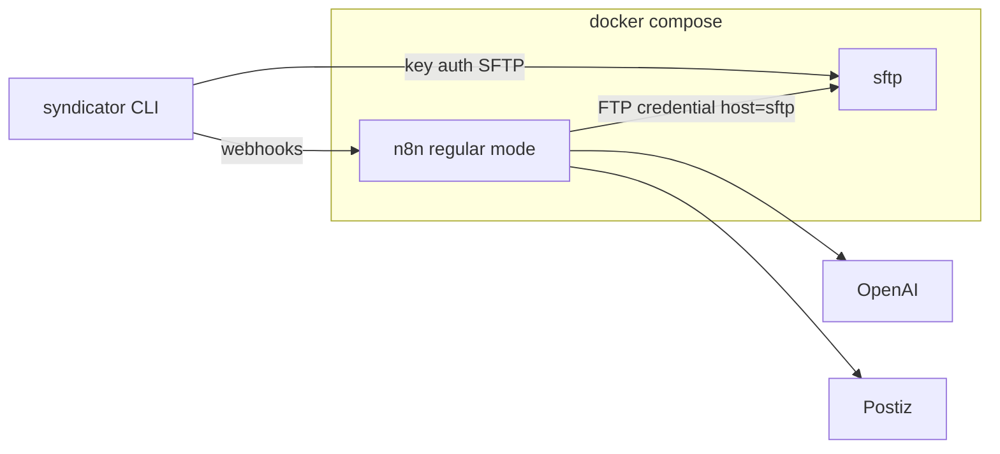

# Phase 1: infrastructure as code (Docker Compose)

Plan for packaging the current syndicator backend (SFTP staging + single n8n) as IaC in this repo. **Phase 2** (queue mode, Redis, Postgres, worker) is out of scope here and only with explicit consent later.

**Status:** not implemented — tracking checklist at the end.

## Principle

Phase 1 is **parity with what we run today**, packaged as IaC so we can start/stop it and evolve later in a controlled way.

- Do **not** add services, DBs, concurrency modes, or client behavior changes unless explicitly agreed.
- Do **not** do forward-looking work “to make Phase 2 easier” without consent.

## Scope

| Phase | Goal | In compose |
| --- | --- | --- |
| **Phase 1 (now)** | Same roles as today: SFTP staging + one n8n; install workflows/credentials from repo; export workflows back into repo | `sftp`, `n8n` (regular mode, default SQLite) |
| **Later (consent only)** | e.g. queue mode / Redis / Postgres / worker — not part of this plan’s deliverables | TBD when requested |

**Do not use `N8N_CONCURRENCY_PRODUCTION_LIMIT`:** not configured; do not set or document it in compose.

**Repo:** all IaC under [`deploy/`](deploy/) in **syndicator**.

---

## Phase 1 target



Postiz remains external (as today). No Redis, no Postgres, no worker in Phase 1.

---

## `deploy/` layout

```
deploy/
  docker-compose.yml
  .env.example
  README.md
  n8n/
    Dockerfile
    workflows/
    credentials/
      *.template.json
  sftp/
    authorized_keys.example
  scripts/
    export-workflows.sh
    bootstrap-n8n.sh
    update.sh
```

**Workflows:** full importable exports in `deploy/n8n/workflows/` are the single source of truth. Legacy workflow JSON under `docs/` (node/connection summaries, incomplete for import) **can be removed** once `deploy/n8n/workflows/` exists — delete them rather than maintaining two copies. Any doc that linked them should point to `deploy/n8n/workflows/` instead.

Export and import must be **scoped to the syndicator workflows** (`Blog Post Publish`, `Reel Publish`, `Adapt Hugo Media`, `Adapt Feature Image`, `Adapt Reel Media`, `Syndicator Error`); the instance also hosts unrelated workflows.

**Secrets:** `deploy/.env` (gitignored); templates in git. [`syndicator.yaml`](syndicator.yaml) stays non-secret hosts/URLs.

**Day-2 edits:** change in n8n → `export-workflows.sh` → commit.

### Bootstrap: credential import

`bootstrap-n8n.sh` runs CLI commands as the `node` user inside the container (`docker compose exec -u node n8n …`). Credential handling has three constraints that the script must satisfy:

1. **Encryption key must be decided up front.** Today the key lives inside the n8n volume at `/home/node/.n8n/config`, not in an env file. Either (a) carry that existing key into `deploy/.env` as `N8N_ENCRYPTION_KEY` when reusing the current volume, or (b) start from a fresh volume with a new key and re-import every credential. A mismatch between key and volume makes all stored credentials undecryptable.
2. **Credential IDs must match the workflow JSON.** Workflow nodes reference credentials by `id` (and name). The templates in `deploy/n8n/credentials/` must keep the IDs from the golden export, otherwise imported workflows come up with unassigned credentials.
3. **Ownership must be explicit on a fresh instance.** `n8n import:credentials` (and `import:workflow`) need `--userId` or `--projectId` so the imported items belong to the owner account; without it they can land unowned and be invisible in the UI. The script resolves the owner/project once and passes it to every import.

Templates are rendered with `envsubst` from `deploy/.env` into a temp file, imported, then deleted — decrypted credential JSON never lands on disk permanently and never in git.

### Bootstrap: workflow activation

Importing is not enough to make webhooks live. `n8n import:workflow` **deactivates every imported workflow by default**, and the `--activeState=fromJson` flag is only supported on multi-main/queue-mode instances — which Phase 1 is not. So the bootstrap must activate explicitly after import:

- Create/read an n8n **Public API key** (stored in `deploy/.env`) and call `POST /api/v1/workflows/{id}/activate` for each webhook-triggered workflow (`Blog Post Publish`, `Reel Publish`).
- Sub-workflows (`Adapt *`) and `Syndicator Error` do not need activation; they are called by other workflows or by the error handler.
- The script verifies afterwards that the production webhook paths respond (`/webhook/publish`, `/webhook/reel`), so a silent "imported but inactive" state cannot pass as success.

---

## SFTP (replace host sshd)

- Compose SFTP with chroot layout `/syndicator/...` (same paths as today).
- Key-only auth; durable volume; publish port for Mac.
- n8n FTP credential: host `sftp` on the compose network.

### The host SFTP service gets retired

Containerizing SFTP is a **replacement, not an addition**. Two SFTP servers on one host means two chroots, two authorized_keys sets, and silent divergence in the staging tree. After cutover the host service is switched off:

1. Verify the container serves the same tree (data migrated, `/syndicator/...` paths identical, Mac upload + n8n download both work).
2. Remove the `sftp` user from `AllowUsers` and drop the `Match Group sftponly` block in `/etc/ssh/sshd_config.d/sftp.conf`, so host sshd only serves the admin login.
3. Lock/remove the host `sftp` account and leave `/srv/sftp` in place read-only until the container volume is verified and backed up, then delete it.
4. Reload sshd and re-test that the old port/user no longer accepts SFTP.

The README documents this as an explicit, ordered cutover step with its rollback (re-enable the `Match` block) — not an afterthought.

---

## n8n (same as today: one process)

- Custom image: community nodes + ffmpeg; pin tag.
- **Regular mode**, default **SQLite** volume (no extra database service).
- Mount `/files` for FFmpeg temps as today.
- Env: `N8N_ENCRYPTION_KEY`, webhook URL/host settings; publish `5678`.

### Updates stay automatic

Today `/home/benno/n8n/update.sh` rebuilds against the upstream `:stable` image and recreates the container, so the host currently self-updates. Phase 1 must **not** regress into a stack that only updates when someone remembers to. Requirements:

- Security updates for the base image and OS packages inside the image apply **automatically**, without manual intervention.
- The existing `update.sh` behaviour moves into the repo (`deploy/scripts/update.sh`) and runs on a schedule (systemd timer or cron on the host), logging to a file as today.
- Pinning is therefore **not** a full version freeze: pin what makes a rebuild reproducible, but keep an automatic path that pulls in patched base images. If a strict pin conflicts with auto-patching, the update job bumps the pin rather than skipping updates.
- The update job is safe to re-run: build, recreate only when the image changed, prune old images, and leave volumes untouched.

---

## Deliverables

1. `docker compose up -d` / `down` → SFTP + n8n.
2. `bootstrap-n8n.sh` installs credentials + workflows, **activates** the webhook workflows, and verifies `/webhook/publish` and `/webhook/reel` respond.
3. `export-workflows.sh` refreshes repo from running n8n (scoped to syndicator workflows); legacy `docs/*.json` workflow exports removed.
4. `.env.example` lists required secrets (including `N8N_ENCRYPTION_KEY` and the n8n API key used for activation).
5. `deploy/scripts/update.sh` plus a scheduled trigger, so security updates keep applying automatically.
6. README: cutover notes (migrate existing SFTP data, retire host sshd SFTP with rollback, point `syndicator.yaml` at compose endpoints).

## Explicitly out of Phase 1

Postgres, Redis, queue mode, n8n worker, webhook client behavior changes, compose convenience wrappers — only if you ask for them later.

---

## Implementation checklist

- [ ] Add `deploy/` with `docker-compose.yml`, `.env.example`, README (up/down/bootstrap)
- [ ] SFTP service: chroot `/syndicator`, key auth, data volume, published port
- [ ] `deploy/n8n/Dockerfile` with community nodes + ffmpeg; compose service + SQLite volume
- [ ] Scoped `export-workflows.sh` + populate `deploy/n8n/workflows/`; remove legacy `docs/*.json` exports
- [ ] Credential `*.template.json` + `bootstrap-n8n.sh` (encryption key, IDs, ownership)
- [ ] Activate webhook workflows via Public API after import; verify `/webhook` paths respond
- [ ] Cutover step to disable host sshd SFTP (`AllowUsers`, `Match` block, account) with rollback
- [ ] Move `update.sh` into `deploy/scripts` and schedule it so security updates stay automatic
- [ ] Document `syndicator.yaml` endpoint changes for the compose stack
